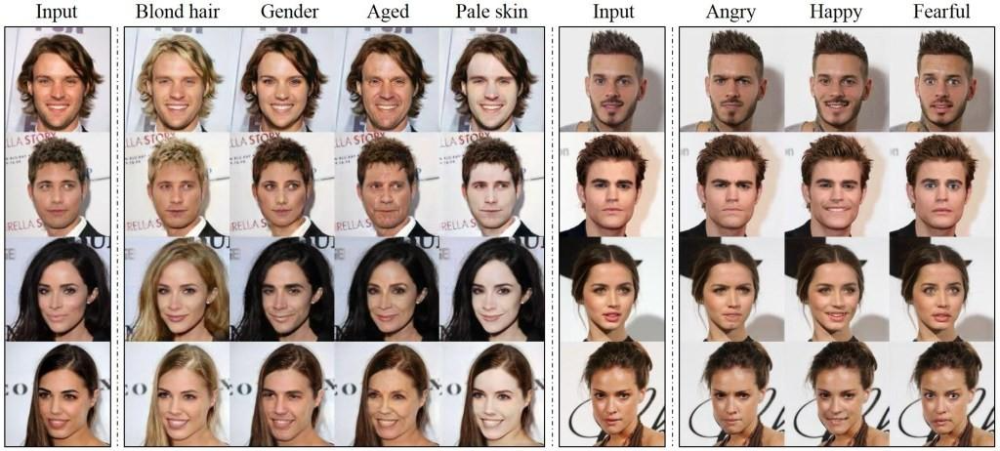
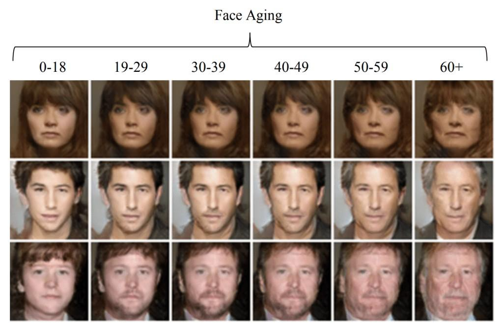
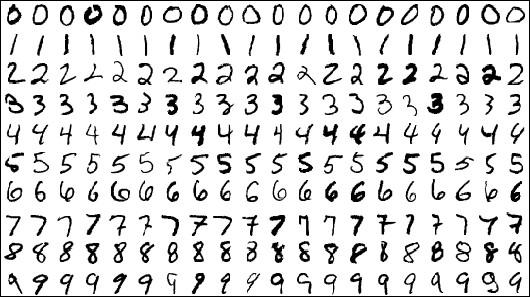
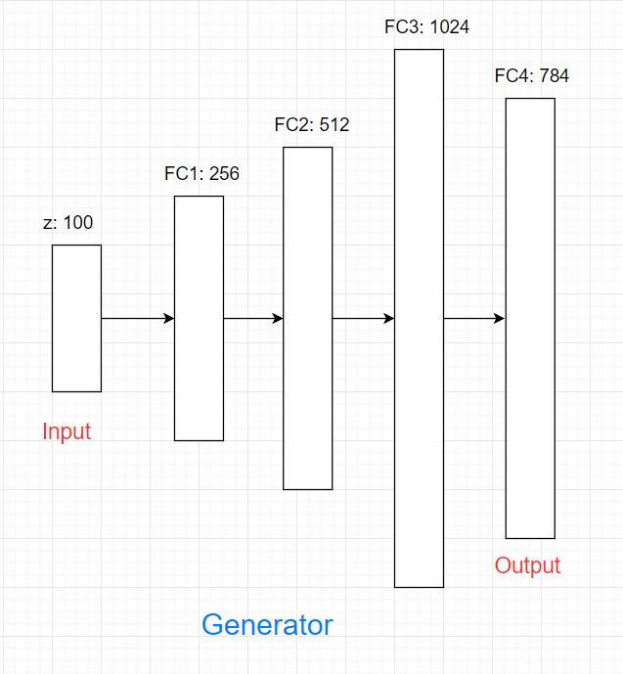
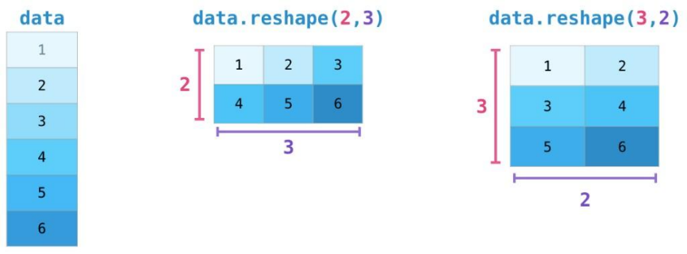
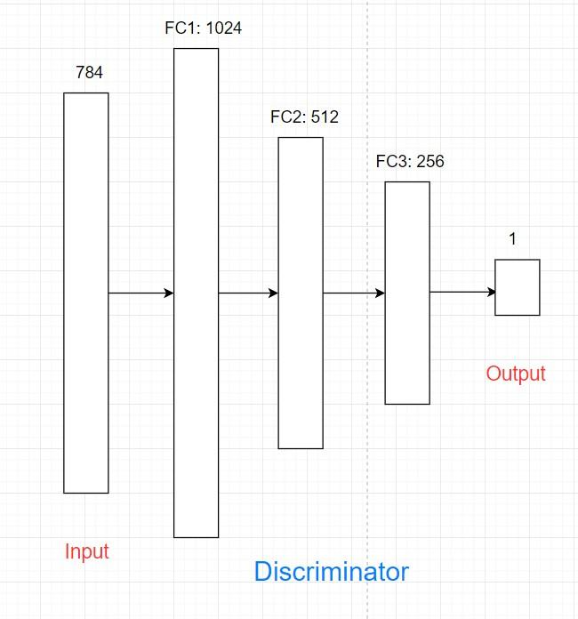

# Public_039

Mô hình GAN được giới thiệu bởi Ian J. Goodfellow vào năm 2014 và đã đạt được rất nhiều thành công lớn trong Deep Learning nói riêng và AI nói chung. Yann LeCun, VP and Chief AI Scientist, Facebook, từng mô tả về GAN: "The most interesting idea in the last 10 years in Machine Learning". Để mọi người thấy được các ứng dụng của GAN, phần dưới tôi sẽ trình bày một vài ứng dụng điển hình của GAN.

# Ứng dụng của GAN

## Generate Photographs of Human Faces

Ví dụ về ảnh mặt người do GAN sinh ra từ 2014 đến 2017. Mọi người có thể thấy chất lượng ảnh sinh ra tốt lên đáng kể theo thời gian.

Hình 20.1: Ảnh mặt GAN sinh ra qua các năm, Malicious Use of Artificial Intelligence: Forecasting, Prevention, and Mitigation, 2018.

Hình dưới là ảnh sinh ra bởi GAN năm 2018, phải để ý rất chi tiết thì mới có thể phân biệt được ảnh mặt đấy là sinh ra hay ảnh thật.

Hình 20.2: [StyleGAN](https://github.com/NVlabs/stylegan)

## Image editing

Chắc mọi người vẫn nhớ tới FaceApp làm mưa làm gió trong thời gian vừa qua. Nó là một ứng dụng của GAN để sửa các thuộc tính của khuôn mặt như màu tóc, da, giới tính, cảm xúc hay độ tuổi.

Hình 20.3: [StarGAN](https://github.com/yunjey/stargan)

Hình 20.4: [Age-cGAN](https://arxiv.org/pdf/1702.01983.pdf)

## Generate Realistic Photographs

Năm 2018, Andrew Brock cho ra paper [bigGAN](https://arxiv.org/abs/1809.11096) với có khả năng sinh ra các ảnh tự nhiên rất khó phân biệt với ảnh chụp thường.

Hình 20.5: Example of Realistic Synthetic Photographs Generated with BigGAN Taken from Large Scale GAN Training for High Fidelity Natural Image Synthesis, 2018.

## Image-to-Image Translation

Ví dụ điển hình của mô hình image to image translation là Pix2pix. Input là 1 ảnh và output là 1 ảnh tương ứng, ví dụ input là ảnh không màu, output là ảnh màu. Mọi người có thể vào [đây](https://affinelayer.com/pixsrv/) thử, input là bản phác (draft) con mèo, output là ảnh con mèo hay input là các khối block, output là ảnh ngôi nhà.

Hình 20.6: Ví dụ ảnh draft sang ảnh màu, taken from Image-to-Image Translation with Conditional Adversarial Networks, 2016.

# GAN là gì?

GAN thuộc nhóm generative model. Generative là tính từ nghĩa là khả năng sinh ra, model nghĩa là mô hình. Vậy hiểu đơn giản generative model nghĩa là mô hình có khả năng sinh ra dữ liệu. Hay nói cách khác, GAN là mô hình có khả năng sinh ra dữ liệu mới. Ví dụ như những ảnh mặt người ở trên bạn thấy là do GAN sinh ra, không phải mặt người thật. Dữ liệu sinh ra nhìn như thật nhưng không phải thật.

GAN viết tắt cho Generative Adversarial Networks. Generative giống như ở trên, Network có nghĩa là mạng (mô hình), còn Adversarial là đối nghịch. Tên gọi như vậy là do GAN được cấu thành từ 2 mạng gọi là Generator và Discriminator, luôn đối nghịch đầu với nhau trong quá trình train mạng GAN. Chi tiết sẽ được trình bày ở phần dưới.

Tóm lại GAN là mạng để sinh dữ liệu mới giống với dữ liệu trong dataset có sẵn và có 2 mạng trong GAN là Generator và Discriminator.

# Cấu trúc mạng GAN

GAN cấu tạo gồm 2 mạng là Generator và Discriminator. Trong khi Generator sinh ra các dữ liệu giống như thật thì Discriminator cố gắng phân biệt đâu là dữ liệu được sinh ra từ Generator và đâu là dữ liệu thật có.

Ví dụ bài toán giờ là dùng GAN để generate ra tiền giả mà có thể dùng để chi tiêu được. Dữ liệu có là tiền thật.

Generator giống như người làm tiền giả còn Discriminator giống như cảnh sát. Người làm tiền giả sẽ cố gắng làm ra tiền giả mà cảnh sát cũng không phân biệt được. Còn cảnh sát sẽ phân biệt đâu là tiền thật và đâu là tiền giả. Mục tiêu cuối cùng là người làm tiền giả sẽ làm ra tiền mà cảnh sát cũng không phân biệt được đâu là thật và đâu là giả và thế là mang tiền đi tiêu được.

Trong quá trình train GAN thì cảnh sát có 2 việc: 1 là học cách phân biệt tiền nào là thật, tiền nào là giả, 2 là nói cho thằng làm tiền giả biết là tiền nó làm ra vẫn chưa qua mắt được và cần cải thiện hơn. Dần dần thì thằng làm tiền giả sẽ làm tiền giống tiền thật hơn và cảnh sát cũng thành thạo việc phân biệt tiền giả và tiền thật. Và mong đợi là tiền giả từ GAN sẽ đánh lừa được cảnh sát.

Ý tưởng của GAN bắt nguồn từ [zero-sum non-cooperative game,](https://cs.stanford.edu/people/eroberts/courses/soco/projects/1998-99/game-theory/nonzero.html) hiểu đơn giản như trò chơi đối kháng 2 người (cờ vua, cờ tướng), nếu một người thắng thì người còn lại sẽ thua. Ở mỗi lượt thì cả 2 đều muốn maximize cơ hội thắng của tôi và minimize cơ hội thắng của đối phương. Discriminator và Generator trong mạng GAN giống như 2 đối thủ trong trò chơi. Trong lý thuyết trò chơi thì GAN model converge khi cả Generator và Discriminator đạt tới trạng thái Nash equilibrium, tức là 2 người chơi đạt trạng thái cân bằng và đi tiếp các bước không làm tăng cơ hội thắng. "A strategy profile is a Nash equilibrium if no player can do better by unilaterally changing his or her strategy", [nguồn.](https://medium.com/cantors-paradise/the-nash-equilibrium-explained-c9ad7e97633a)

**Bài toán** : Dùng mạng GAN sinh ra các chữ số viết tay giống với dữ liệu trong [MNIST dataset.](http://yann.lecun.com/exdb/mnist/)

## Generator

Generator là mạng sinh ra dữ liệu, tức là sinh ra các chữ số giống với dữ liệu trong MNIST dataset. Generator có input là noise (random vector) là output là chữ số.

Tại sao input là noise? Vì các chữ số khi viết ra không hoàn toàn giống nhau. Ví dụ số 0 ở hàng đầu tiên có rất nhiều biến dạng nhưng vẫn là số 0. Thế nên input của Generator là noise để khi ta thay đổi noise ngẫu nhiên thì Generator có thể sinh ra một biến dạng khác của chữ viết tay. Noise cho Generator thường được sinh ra từ normal distribution hoặc uniform distribution.

Hình 20.14: MNIST dataset, [nguồn](https://syncedreview.com/2019/06/19/mnist-reborn-restored-and-expanded-additional-50k-training-samples/)

Input của Generator là noise vector 100 chiều. Sau đấy mô hình neural network được áp dụng với số node trong hidden layer lần lượt là 256, 512, 1024.

Hình 20.15: Mô hình generator

Output layer có số chiều là 784, vì output đầu ra là ảnh giống với dữ liệu MNIST, ảnh xám kích thước 28*28 (784 pixel).

Output là vector kích thước 784*1 sẽ được reshape về 28*28 đúng định dạng của dữ liệu MNIST.

Hình 20.16: Ví dụ về reshape, [nguồn](http://jalammar.github.io/visual-numpy/)

## Discriminator

Discriminator là mạng để phân biệt xem dữ liệu là thật (dữ liệu từ dataset) hay giả (dữ liệu sinh ra từ Generator). Trong bài toán này thì discriminator dùng để phân biệt chữ số từ bộ MNIST và dữ liệu sinh ra từ Generator. Discriminator có input là ảnh biểu diễn bằng 784 chiều, output là ảnh thật hay ảnh giả.

Đây là bài toán binary classification, giống với [logistic regression.](https://nttuan8.com/bai-2-logistic-regression/)

Hình 20.17: Ví dụ về reshape, [nguồn](http://jalammar.github.io/visual-numpy/)

Input của Discriminator là ảnh kích thước 784 chiều.

Sau đấy mô hình neural network được áp dụng với số node trong hidden layer lần lượt là 1024, 512, 256. Mô hình đối xứng lại với Generator.

Output là 1 node thể hiện xác suất ảnh input là ảnh thật, hàm sigmoid được sử dụng.