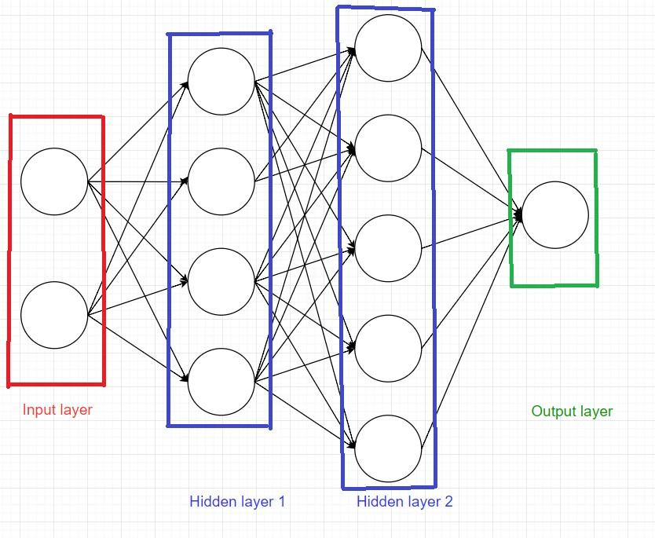
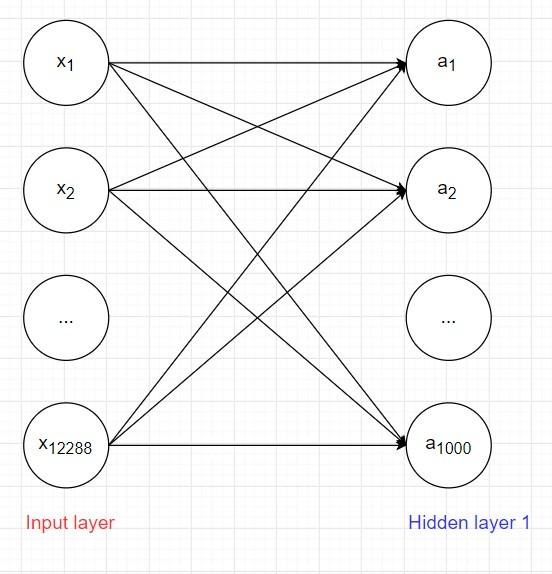
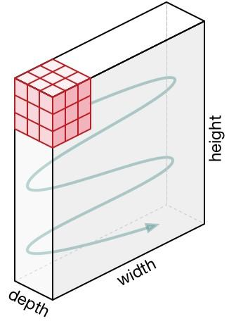
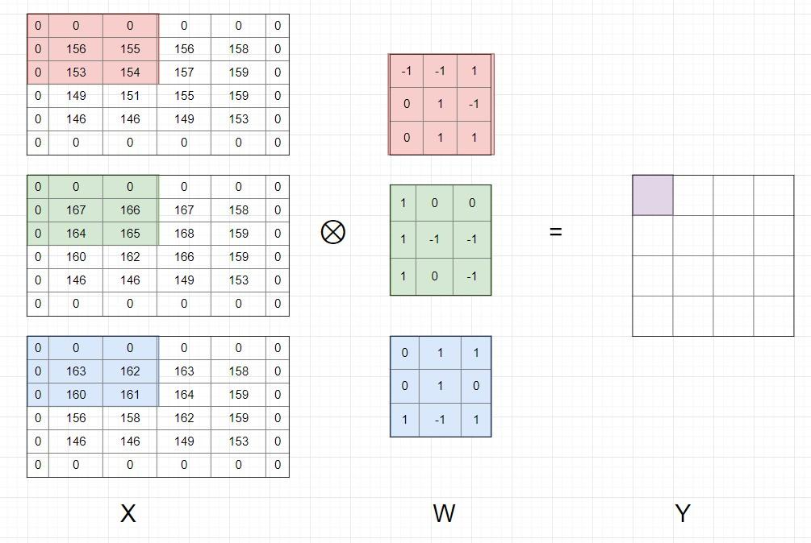
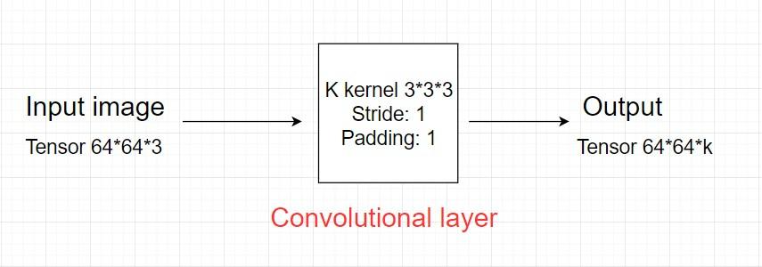
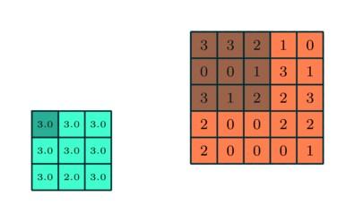
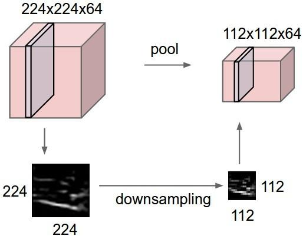
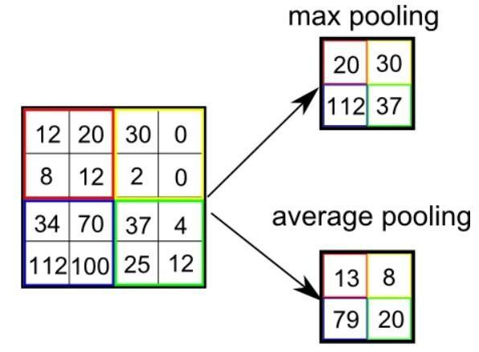
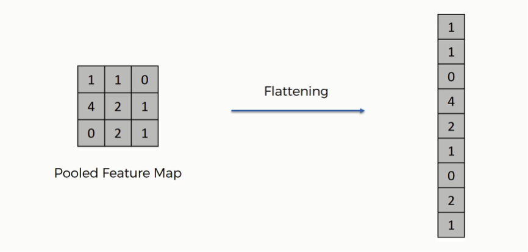

# Public_044

# Thiết lập bài toán

Gần đây việc kiểm tra mã captcha để xác minh không phải robot của google bị chính robot vượt qua

Hình 8.1: Robot vượt qua kiểm tra captcha
Thế nên google quyết định cho ra thuật toán mới, dùng camera chụp ảnh người dùng và dùng deep learning để xác minh xem ảnh có chứa mặt người không thay cho hệ thống captcha cũ.
Bài toán: Input một ảnh màu kích thước 64*64, output ảnh có chứa mặt người hay không.

# Convolutional neural network

## Convolutional layer

Mô hình neural network từ những bài trước

Hình 8.2: Mô hình neural network.
Mỗi hidden layer được gọi là fully connected layer, tên gọi theo đúng ý nghĩa, mỗi node trong hidden layer được kết nối với tất cả các node trong layer trước. Cả mô hình được gọi là fully connected neural network (FCN).
Như bài trước về xử lý ảnh, thì ảnh màu 64*64 được biểu diễn dưới dạng 1 tensor 64*64*3. Nên để biểu thị hết nội dung của bức ảnh thì cần truyền vào input layer tất cả các pixel (64*64*3 = 12288). Nghĩa là input layer giờ có 12288 nodes.

Hình 8.3: Input layer và hidden layer 1
Giả sử số lượng node trong hidden layer 1 là 1000. Số lượng weight W giữa input layer và hidden layer 1 là 12288*1000 = 12288000, số lượng bias là 1000 => tổng số parameter là: 12289000. Đấy mới chỉ là số parameter giữa input layer và hidden layer 1, trong model còn nhiều layer nữa, và nếu kích thước ảnh tăng, ví dụ 512*512 thì số lượng parameter tăng cực kì nhanh => Cần giải pháp tốt hơn !!!
Nhận xét:

  * Trong ảnh các pixel ở cạnh nhau thường có liên kết với nhau hơn là những pixel ở xa. Ví dụ như phép tính convolution trên ảnh ở bài trước. Để tìm các đường trong ảnh, ta áp dụng sobel kernel trên mỗi vùng kích thước 3*3. Hay làm nét ảnh ta áp dụng sharpen kernel cũng trên vùng có kích thước 3*3.

  * Với phép tính convolution trong ảnh, chỉ 1 kernel được dùng trên toàn bộ bức ảnh. Hay nói cách khác là các pixel ảnh chia sẻ hệ số với nhau.

=> Áp dụng phép tính convolution vào layer trong neural network ta có thể giải quyết được vấn đề lượng lớn parameter mà vẫn lấy ra được các đặc trưng của ảnh.

### Convolutional layer đầu tiên

Bài trước phép tính convolution thực hiện trên ảnh xám với biểu diễn ảnh dạng ma trận

Tuy nhiên ảnh màu có tới 3 channels red, green, blue nên khi biểu diễn ảnh dưới dạng tensor 3 chiều. Nên ta cũng sẽ định nghĩa kernel là 1 tensor 3 chiều kích thước k*k*3.

Hình 8.4: Phép tính convolution trên ảnh màu với k=3.
Ta định nghĩa kernel có cùng độ sâu (depth) với biểu diễn ảnh, rồi sau đó thực hiện di chuyển khối kernel tương tự như khi thực hiện trên ảnh xám.

Hình 8.5: Tensor X, W 3 chiều được viết dưới dạng 3 matrix.
Khi biểu diễn ma trận ta cần 2 chỉ số hàng và cột: i và j, thì khi biểu diễn ở dạng tensor 3 chiều cần thêm chỉ số độ sâu k. Nên chỉ số mỗi phần tử trong tensor là _x ijk_.
Nhận xét:

  * Output Y của phép tính convolution trên ảnh màu là 1 matrix.

  * Có 1 hệ số bias được cộng vào sau bước tính tổng các phần tử của phép tính element-wise

**Các quy tắc đối với padding và stride toàn hoàn tương tự như ở bài trước.**
Với mỗi kernel khác nhau ta sẽ học được những đặc trưng khác nhau của ảnh, nên trong mỗi convolutional layer ta sẽ dùng nhiều kernel để học được nhiều thuộc tính của ảnh. Vì mỗi kernel cho ra output là 1 matrix nên k kernel sẽ cho ra k output matrix. Ta kết hợp k output matrix này lại thành 1 tensor 3 chiều có chiều sâu k.

Hình 8.6: Thực hiện phép tính convolution trên ảnh màu.

Hình 8.7: Convolutional layer đầu tiên
Output của convolutional layer đầu tiên sẽ thành input của convolutional layer tiếp theo.

### Convolutional layer tổng quát

Giả sử input của 1 convolutional layer tổng quát là tensor kích thước H * W * D.
Kernel có kích thước F * F * D (kernel luôn có depth bằng depth của input và F là số lẻ), stride: S, padding: P.
Convolutional layer áp dụng K kernel.
=> Output của layer là tensor 3 chiều có kích thước: $$
(H−F+2PS+1)*(W−F+2PS+1)left( frac{H - F + 2P}{S} + 1 right)*left( frac{W - F + 2P}{S} + 1 right)
$$∗ _K_
Lưu ý:

  * Output của convolutional layer sẽ qua hàm non-linear activation function trước khi trở thành input của convolutional layer tiếp theo.

  * Tổng số parameter của layer: Mỗi kernel có kích thước F*F*D và có 1 hệ số bias, nên tổng parameter của 1 kernel là F*F*D + 1. Mà convolutional layer áp dụng K kernel => Tổng số parameter trong layer này là K * (F*F*D + 1).

## Pooling layer

Pooling layer thường được dùng giữa các convolutional layer, để giảm kích thước dữ liệu nhưng vẫn giữ được các thuộc tính quan trọng. Việc giảm kích thước dữ liệu giúp giảm các phép tính toán trong model.
Bên cạnh đó, với phép pooling kích thước ảnh giảm, do đó lớp convolution học được các vùng có kích thước lớn hơn. Ví dụ như ảnh kích thước 224*224 qua pooling về 112*112 thì vùng 3*3 ở ảnh 112*112 tương ứng với vùng 6*6 ở ảnh ban đầu. Vì vậy qua các pooling thì kích thước ảnh nhỏ đi và convolutional layer sẽ học được các thuộc tính lớn hơn.
Gọi pooling size kích thước K*K. Input của pooling layer có kích thước H*W*D, ta tách ra làm D ma trận kích thước H*W. Với mỗi ma trận, trên vùng kích thước K*K trên ma trận ta tìm maximum hoặc average của dữ liệu rồi viết vào ma trận kết quả. Quy tắc về stride và padding áp dụng như phép tính convolution trên ảnh.

Hình 8.8: max pooling layer với size=(3,3), stride=1, padding=0
Nhưng hầu hết khi dùng pooling layer thì sẽ dùng size=(2,2), stride=2, padding=0. Khi đó output width và height của dữ liệu giảm đi một nửa, depth thì được giữ nguyên.

Hình 8.9: Sau pooling layer (2*2) [4]
Có 2 loại pooling layer phổ biến là: max pooling và average pooling.

Hình 8.10: Ví dụ về pooling layer
**Trong một số model người ta dùng convolutional layer với stride > 1 để giảm kích thước dữ liệu thay cho pooling layer.**

## Fully connected layer

Sau khi ảnh được truyền qua nhiều convolutional layer và pooling layer thì model đã học được tương đối các đặc điểm của ảnh (ví dụ mắt, mũi, khung mặt,...) thì tensor của output của layer cuối cùng, kích thước H*W*D, sẽ được chuyển về 1 vector kích thước (H*W*D, 1)

Sau đó ta dùng các fully connected layer để kết hợp các đặc điểm của ảnh để ra được output của model.

# Mạng VGG 16

VGG16 là mạng convolutional neural network được đề xuất bởi K. Simonyan and A. Zisserman, University of Oxford. Model sau khi train bởi mạng VGG16 đạt độ chính xác 92.7% top-5 test trong dữ liệu ImageNet gồm 14 triệu hình ảnh thuộc 1000 lớp khác nhau. Giờ áp dụng kiến thức ở trên để phân tích mạng VGG 16.

Hình 8.11: Kiến trúc VGG16 conv: convolutional layer, pool: pooling layer, fc: fully connected layer
Phân tích:

  * Convolutional layer: kích thước 3*3, padding=1, stride=1. Tại sao không ghi stride, padding mà vẫn biết? Vì mặc định sẽ là stride=1 và padding để cho output cùng width và height với input.

  * Pool/2 : max pooling layer với size 2*2

  * 3*3 conv, 64: thì 64 là số kernel áp dụng trong layer đấy, hay depth của output của layer đấy.

  * Càng các convolutional layer sau thì kích thước width, height càng giảm nhưng depth càng tăng.