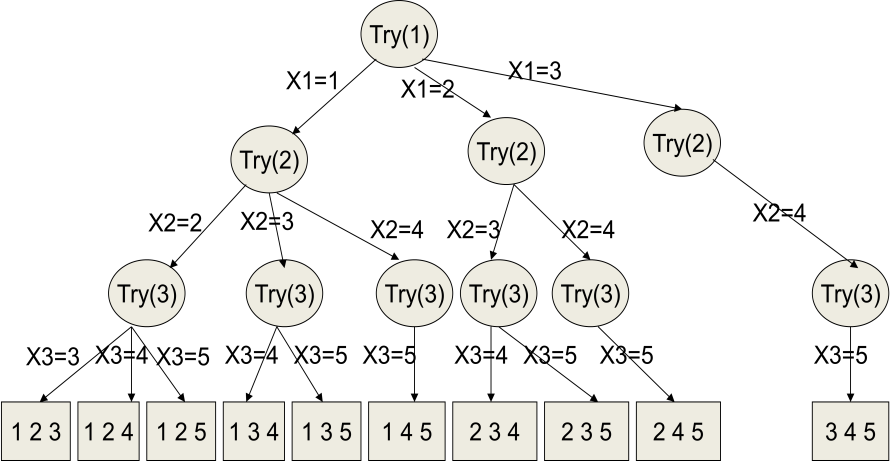
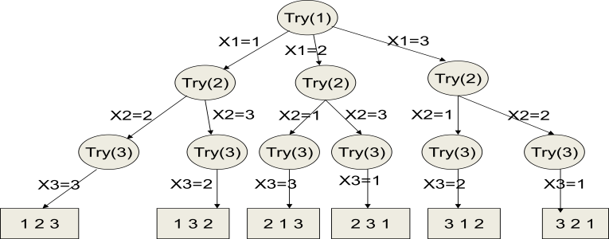
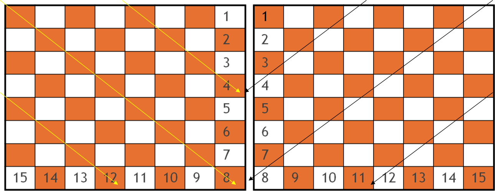

# Public_052

# Mô hình thuật toán quay lui (Backtrack Algorithm)

Giả sử ta cần xác định bộ _X_ =( _x_ 1, _x_ 2,.., _x_ n) thỏa mãn một số ràng buộc nào đó. Ứng với mỗi thành phần _x_ i ta có _n_ i khả năng cần lựa chọn. Ứng với mỗi khả năng _j∈ni_ dành cho thành phần xi ta cần thực hiện:

  * _Kiểm tra xem khả năng j có được chấp thuận cho thành phần xi hay không? Nếu khả năng j được chấp thuận thì ta xác định thành phần xi theo khả năng j. Nếu i là thành phần cuối cùng (i=n) ta ghi nhận nghiệm của bài toán. Nếu i chưa phải cuối cùng ta xác định thành phần thứ i +1._

  * _Nếu không có khả năng j nào được chấp thuận cho thành phần xi thì ta quay lại bước trước đó (i-1) để thử lại các khả năng còn lại._

Thuật toán quay lui được mô tả như sau:
Thuật toán Back-Track ( int i ) {
for ( j =<Khả năng 1>; j <=ni; j++ ){ if (<chấp thuận khả năng j>) {
X[i] = <khả năng j>; if ( i ==n) Result(); else Back-Track(i+1);
}
}
**Ví dụ 2.7**. Duyệt các xâu nhị phân có độ dài n.
**Lời giải**. Xâu nhị phân _X_ = ( _x_ 1, _x_ 2,.., _x_ n)| xi =0, 1. Mỗi _x_ i∈X có hai lựa chọn xi=0, 1. Cả hai giá trị này đều được chấp thuận mà không cần có thêm bất kỳ điều kiện gì. Thuật toán được mô tả như sau:
void Try ( int i ) {
for (int j =0; j<=1; j++){ X[i] = j;
if (i ==n) Result(); else Try (i+1);
}
}
Khi đó, việc duyệt các xâu nhị phân có độ dài n ta chỉ cần gọi đến thủ tục Try(1). Cây quay lui được mô tả như Hình 2.1 dưới đây.

**Hình 2.1**. _Duyệt các xâu nhị phân độ dài 3_
Chương trình duyệt các xâu nhị phân có độ dài n bằng thuật toán quay lui được thể hiện như dưới đây.
#include <iostream> #include <iomanip> #define MAX 100 using namespace std; int X[MAX], n, dem=0;
void Init(){ // _thiết lập độ dài xâu nhị phân  
_cout<<"\n Nhập n="; cin>>n;
}
void Result(void){ // _In ra xâu nhị phân X[] = x_ 1 _, x_ 2 _,.., x_ n
cout<<"\n Kết quả "<<++dem<<":"; for(int i =1; i<=n; i++)
cout<<X[i]<<setw(3);
}
void Try(int i){ // _thuật toán quay lui_
for (int j=0; j<=1; j++){ // _duyệt các khả năng j dành cho x_ i
X[i]=j; // _thiết lập thành phần x_ i _là j_
if(i==n) // _nếu i là thành phần cuối cùng_
Result(); // _ta đưa ra kết quả_
else // _trong trường hợp khác_
Try(i+1); // _ta xác định tiếp thành phần x_ i+1
}
}
int main(void){ Init(); Try(1);}

**Ví dụ 2**. **8.** Duyệt các tập con K phần tử của 1, 2, .., N.

**Lời giải**. Mỗi tập con K phần tử _X_ = ( _x_ 1, _x_ 2,.., _x_ K) là bộ không tính đến thứ tự K phần tử của 1, 2, .., N. Mỗi _x_ i∈X có N-K+i lựa chọn. Các giá trị này đều được chấp thuận mà không cần có thêm bất kỳ điều kiện gì. Thuật toán được mô tả như sau:
void Try ( int i ) {
for (int j =X[i-1]+1; j<=N-K+ i; j++){ X[i] = j;
if (i ==K) Result(); else Try (i+1);
}
}
Khi đó, việc duyệt các tập con K phần tử của 1, 2, .., N ta chỉ cần gọi đến thủ tục Try(1). Cây quay lui được mô tả như hình dưới đây.

**Hình 2.2**. _Duyệt các tập con 3 phần tử của 1, 2, 3, 4, 5._
Chương trình liệt kê các tập con k phần tử của 1, 2, ..,n được thể hiện như sau. #include <iostream>
#include <iomanip> #define MAX 100 using namespace std;
int X[MAX], n, k, dem=0;
void Init(){// _thiết lập giá trị cho n, k_
cout<<"\n Nhập n, k: "; cin>>n>>k;
}
void Result(void){ cout<<"\n Kết quả "<<++dem<<":";// _đưa ra kết quả_
for(int i =1; i<=k; i++) cout<<X[i]<<setw(3);
}
void Try(int i){// _thuật toán quay lui_
for (int j=X[i-1]+1; j<=n-k+i; j++){ // _duyệt trên tập khả năng dành cho x_ i
X[i]=j; // _thiết lập thành phần xi là j_
if(i==k) // _nếu x_ i _đã là thành phần cuối_
Result(); // _ta đưa ra kết quả_
else // _trong trường hợp khác_
Try(i+1); // _ta đi xác định thành phần thứ x_ i+1
}
}
int main(void){
Init(); X[0] =0 ; Try(1);
}
**Ví dụ 2.9**. Duyệt các hoán vị của 1, 2, .., N.
**Lời giải**. Mỗi hoán vị _X_ = ( _x_ 1, _x_ 2,.., _x_ K) là bộ có tính đến thứ tự của 1, 2, .., N. Mỗi _x_ i∈X có N lựa chọn. Khi xi = j được lựa chọn thì giá trị này sẽ không được chấp thuận cho các thành phần còn lại. Để ghi nhận điều này, ta sử dụng mảng chuaxet[] gồm N phần tử. Nếu chuaxet[i] = True điều đó có nghĩa giá trị i được chấp thuận và chuaxet[i] = False tương ứng với giá trị i không được phép sử dụng. Thuật toán được mô tả như sau:
void Try ( int i ) {
for (int j=1; j<=N; j++){ if (chuaxet[j] ) {
X[i] = j;chuaxet[j] = False; if ( i ==N) Result();
else Try (i+1); Chuaxet[j] = True;
}
}
}
Khi đó, việc duyệt các hoán vị của 1, 2, .., N ta chỉ cần gọi đến thủ tục Try(1). Cây quay lui được mô tả như hình dưới đây.

**Hình 2.3**. Duyệt các hoán vị của 1, 2, 3.

Chương trình liệt kê tất cả các hoán vị của 1, 2, .., n được thể hiện như sau: |  
#include <iostream>

#include <iomanip> #define MAX 100  
using namespace std;  
int X[MAX], n, dem=0; bool chuaxet[MAX];
void Init(){// _thiết lập giá trị cho n_
cout<<"\n Nhập n="; cin>>n;
for(int i=1; i<=n; i++) // _thiết lập giá trị cho mảng chuaxet[]_
chuaxet[i]=true;
}
void Result(void){ // _Đưa ra hoán vị hiện tại_
cout<<"\n Kết quả "<<++dem<<":";
for(int i =1; i<=n; i++) cout<<X[i]<<setw(3);
}
void Try(int i){ // _thuật toán quay lui duyệt các hoán vị của 1, 2, .., n._
for (int j=1; j<=n; j++){ // _duyệt các khả năng j cho thành phần xi_
if(chuaxet[j]){ // _nếu khả năng j đúng chưa được dùng đến_ X[i]=j; // _thiết lập thành phần xi là j  
_chuaxet[j]=false; // _thiết lập chuaxet[j] đã được dùng_ if(i==n) // _nếu xi đã là thành phần cuối cùng_
Result();// _ta đưa ra kết quả_
else /// _trong trường hợp khác_
Try(i+1); // _ta xác định tiếp thành phần thứ i+1_
chuaxet[j]=true; // _nhớ hoàn trả lại giá trị cho chuaxet[j]_
}
}
}
int main(void){
Init(); Try(1);
}
**Ví dụ 2.10**. Bài toán N quân hậu. Trên bàn cờ kích cỡ N×N, hãy đặt N quân hậu mỗi quân trên 1 hàng sao cho tất cả các quân hậu đều không ăn được lẫn nhau.
**Lời giải**. Gọi X =(x1, x2,..,xn) là một hoán vị của 1, 2, .., n.. Khi đó, xi = j được hiểu là quân hậu hàng thứ i đặt ở cột j. Để các quân hậu khác không thể ăn được, quân hậu thứ i cần không được lấy trùng với bất kỳ cột nào, không được cùng đường chéo xuôi, không được cùng trên đường chéo ngược. Ta có n cột Cot = (c1,..cn), có Xuoi[2*n-1] đường chéo xuôi, Nguoc[2*n-1] đường chéo ngược. Quân hậu ở hàng _i_ được đặt vào cột _j_ nếu A[j] = True (chưa có quân hậu nào án ngữ cột j), Xuoi[i-j+n] = True (chưa có quân hậu nào án ngữ đường chéo i-j+n), Nguoc[i + j -1] = True (chưa có quân hậu nào án ngữ đường chéo ngược i + j-1).
Đường chéo xuôi Xuoi[i-j+n] Đường chéo ngược Nguoc[i+j-1]
**Hình 2.4**. _Mô tả các đường chéo, xuôi đường chéo ngược_
Thuật toán quay lui giải bài toán n quân hậu được mô tả như dưới đây. void Try (int i){
for(int j=1; j<=n; j++){
if( Cot[j] && Xuoi[ i – j + n ] && Nguoc[i + j -1]){ X[i] =j; Cot[j]=FALSE;
Xuoi[ i - j + n]=FALSE; Nguoc[ i + j - 1]=FALSE; if(i==n) Result();
else Try(i+1); Cot[j] = TRUE;
Xuoi[ i - j + n] = TRUE; Nguoc[ i + j - 1] = TRUE;
}
}
}
Chương trình giải bài toán n quân hậu được thể hiện như dưới đây. #include <iostream>
#include <iomanip> #define MAX 100  
using namespace std;  
int X[MAX], n, dem=0;
bool COT[MAX], DCXUOI[MAX], DCNGUOC[MAX];;

void Init(){ // _thiết lập kích cỡ bàn cờ_

cout<<"\n Nhap n="; cin>>n;

for(int i=1; i<=n; i++){ // _thiết lập tất cả các cột đều chưa bị án ngữ_
COT[i]=true;
}
for(int i=1; i<2*n; i++){ // _thiết lập các đường chéo_ DCXUOI[i]=true; // _đường chéo xuôi chưa bị án ngữ_ DCNGUOC[i]=true; // _đường chéo ngược chưa bị án ngữ_
}
}
void Result(void){ // _đưa ra một phương án_ cout<<"\n Kết quả "<<++dem<<":"; for(int i =1; i<=n; i++)
cout<<X[i]<<setw(3);
}
void Try(int i){ // _đây là thuật toán quay lui_
for (int j=1; j<=n; j++){ // _duyệt các khả năng j đặt quân hậu vào hàng i_
if( COT[j] && DCXUOI[i-j+n]&& DCNGUOC[i+j-1]){
// _nếu đúng cột j, đường chéo xuôi i-j +n, đường chéo ngược i+j-1_
_// chưa bị án ngữ_
X[i]=j; // _ta đặt được quân hậu hàng i vào vột j_
COT[j] = false; // _cột j đã bị án ngữ_
DCXUOI[i-j+n]=false; // _đường chéo xuôi i-j+n bị án ngữ_ DCNGUOC[i+j-1]=false;// _đường chéo ngược i+j-1 bị án ngữ_ if(i==n) // _nếu đây là quân hậu hàng n_
Result();// _ta đưa ra phương án hiện tại_
else // _trong trường hợp khác_
Try(i+1); // _ta đặt tiếp quân hậu hành i+1_
COT[j] = true; // _nhớ trả lại giá trị cột j_
DCXUOI[i-j+n]=true; // _trả lại giá trị đường chéo xuôi_
DCNGUOC[i+j-1]=true; // _trả lại giá trị đường chéo ngược_
}
}
}
int main(void){ Init(); Try(1); }