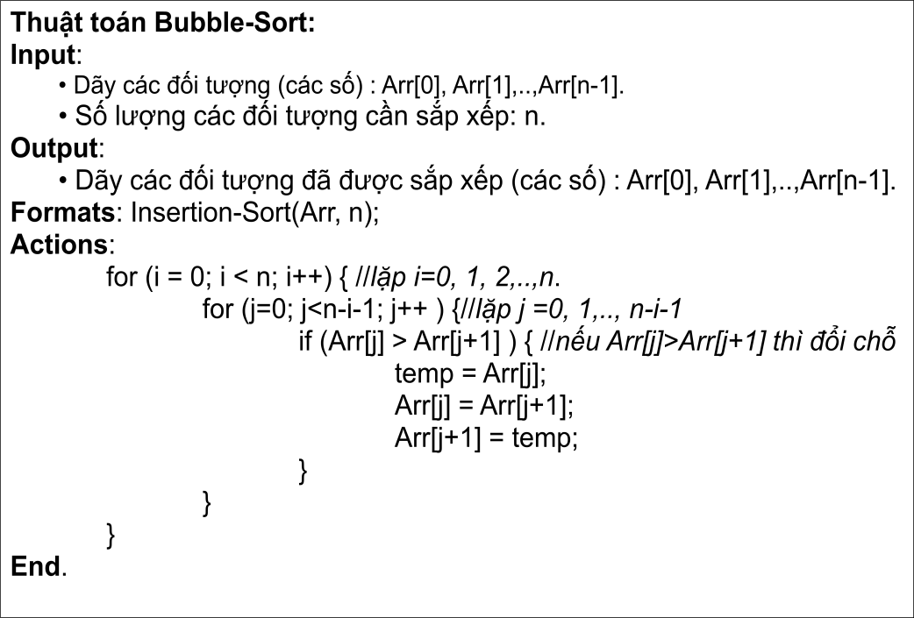
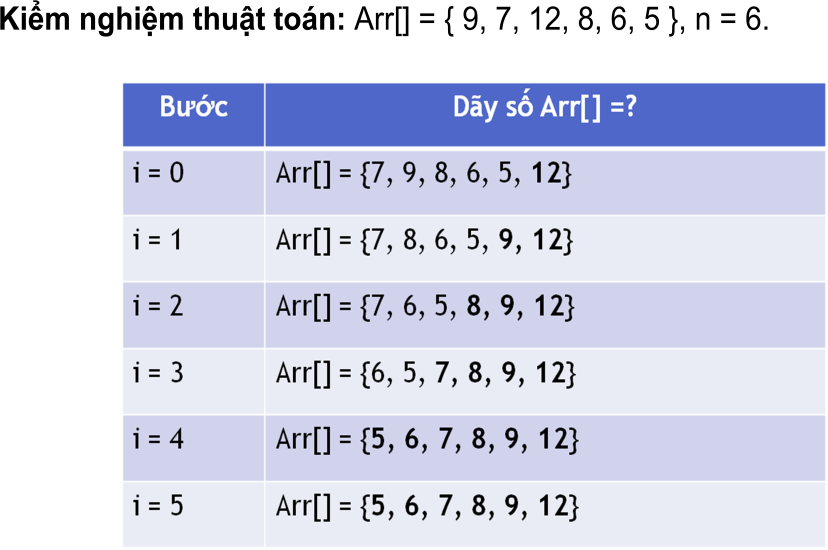
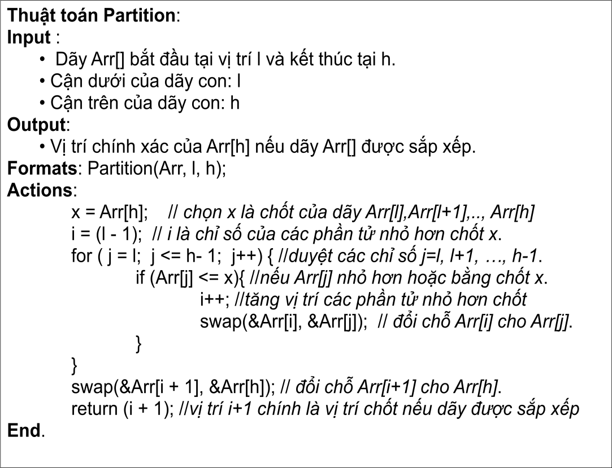
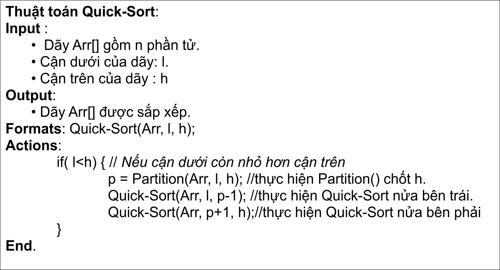
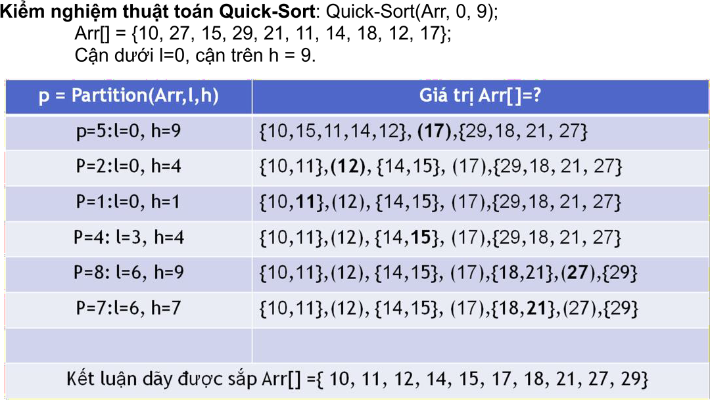
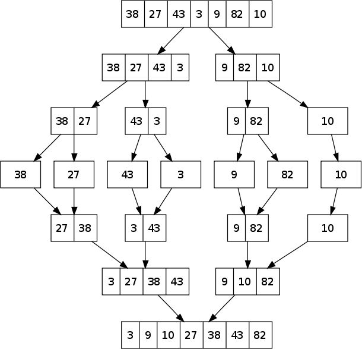
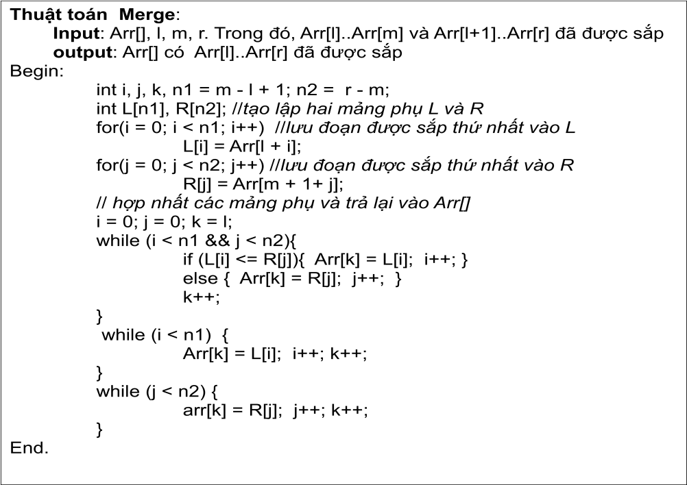
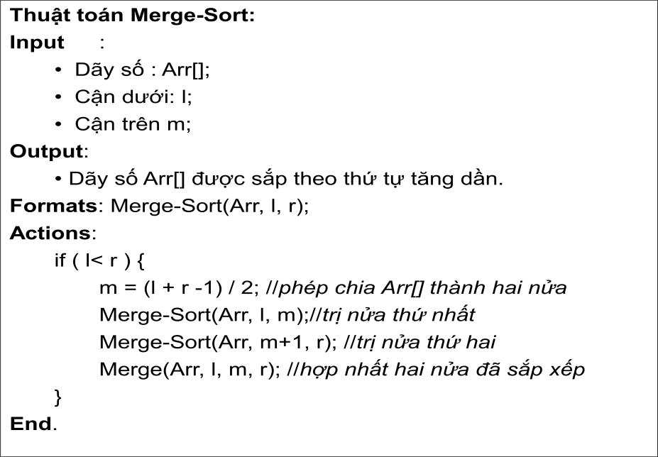
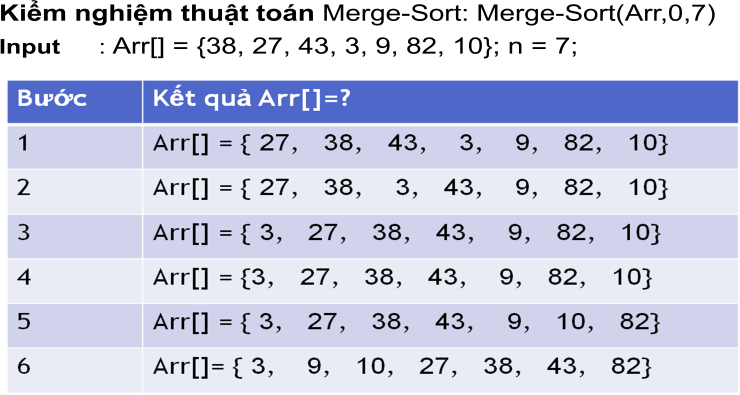

# Public_054

# Thuật toán Bubble Sort

Thuật toán sắp xếp kiểu sủi bọt được thực hiện đơn giản bằng cách tráo đổi hai phần từ liền kề nhau nếu chúng chưa được sắp xếp. Thuật toán được mô tả chi tiết trong Hình 3.3.

##  Biểu diễn thuật toán

**Hình 3.3**. Thuật toán Bubble Sort

## Độ phức tạp thuật toán

Độ phức tạp thuật toán là O(N2), với N là số lượng phần tử. Bạn đọc tự tìm hiểu phương pháp ước lượng và chứng minh độ phức tạp thuật toán Bubble Sort trong các tài liệu liên quan.

## Kiểm nghiệm thuật toán

## Cài đặt thuật toán

#include <iostream>  
#include <iomanip>  
using namespace std;

void swap(int *x, int *y){ // _đổi chỗ hai số x và y_
int temp = *x; *x = *y;*y = temp;
}
void bubbleSort(int arr[], int n){ // _thuật toán bubble sort_
int i, j;
for (i = 0; i < n; i++) {

for (j = 0; j < n-i-1; j++) {

if (arr[j] > arr[j+1])

swap(&arr[j], &arr[j+1]);
}
}
}
void printArray(int arr[], int size){  
cout<<"\n Dãy được sắp:";  
for (int i=0; i < size; i++)
cout<<arr[i]<<setw(3);
}
int main(){
int arr[] = {64, 34, 25, 12, 22, 11, 90};
int n = sizeof(arr)/sizeof(arr[0]); bubbleSort(arr, n); printArray(arr, n);
}

# Thuật toán Quick Sort

Thuật toán sắp xếp Quick-Sort được thực hiện theo mô hình chia để trị (Divide and Conquer). Thuật toán được thực hiện xung quanh một phần tử gọi là chốt (key). Mỗi cách lựa chọn vị trí phần tử chốt trong dãy sẽ cho ta một phiên bản khác nhau của thuật toán. Các phiên bản (version) của thuật toán Quicksort bao gồm:

  * Luôn lựa chọn phần tử đầu tiên trong dãy làm chốt.

  * Luôn lựa chọn phần tử cuối cùng trong dãy làm chốt.

  * Luôn lựa chọn phần tử ở giữa dãy làm chốt.

  * Lựa chọn phần tử ngẫu nhiên trong dãy làm chốt.

Mấu chốt của thuật toán Quick-Sort là làm thế nào ta xây dựng được một thủ tục phân đoạn (Partition). Thủ tục Partition có hai nhiệm vụ chính:

  * Định vị chính xác vị trí của chốt trong dãy nếu được sắp xếp;

  * Chia dãy ban đầu thành hai dãy con: dãy con ở phía trước phần tử chốt bao gồm các phần tử nhỏ hơn hoặc bằng chốt, dãy ở phía sau chốt có giá trị lớn hơn chốt.

Thuật toán Partition được mô tả chi tiết trong Hình 3.4 với khóa chốt là phần tử cuối cùng của dãy. Phiên bản Quick Sort tương ứng được mô tả chi tiết trong Hình 3.5.

##  Biểu diễn thuật toán

**Hình 3.4**. Thuật toán Partition với chốt là vị trí cuối cùng của dãy

**Hình 3.5**. Thuật toán Quick-Sort với chốt là vị trí cuối cùng của dãy

##  Độ phức tạp thuật toán

Độ phức tạp thuật toán trong trường hợp xấu nhất là O(N2), trong trường hợp tốt nhất là O(N.Log(N)), với N là số lượng phần tử. Bạn đọc tự tìm hiểu và chứng minh độ phức tạp thuật toán Quick Sort trong các tài liệu liên quan.

## Kiểm nghiệm thuật toán

**2.4. Cài đặt thuật toán** #include<iostream> #include<iomanip>

using namespace std;

void swap(int* a, int* b){ // _đổi chỗ a và b_
int t = *a; *a = *b; *b = t;
}
int partition (int arr[], int l, int h){ // _thuật toán partition chốt h_
int x = arr[h]; // _x chính là chốt_
int i = (l - 1); // _i lấy vị trí nhỏ hơn l_
for (int j = l; j <= h- 1; j++) {// _duyệt từ l đến h-1_
// If current element is smaller than or equal to pivot if (arr[j] <= x){ // _nếu arr[j] bé hơn hoặc bằng chốt_
i++; // _tăng i lên một đoen vị_
swap(&arr[i], &arr[j]); // _đổi chỗ arr[i] cho arr[j]_
}
}
swap(&arr[i + 1], &arr[h]); // _đổi chỗ cho arr[i+1] và arr[h]_
return (i + 1); // _đây là vị trí của chốt_
}
void quickSort(int arr[], int l, int h){ if (l < h){
int p = partition(arr, l, h); // _tìm vị trí của chốt_
quickSort(arr, l, p - 1);// _trị nửa bên trái_
quickSort(arr, p + 1, h);// _trị nửa bên phải_
}
}
void printArray(int arr[], int size){ // _thủ tục in kết quả_
int i; cout<<"\n _Dãy được sắp_ :"; for (i=0; i < size; i++)
cout<<arr[i]<<setw(3);
}
int main(){ // _chương trình chính_
int arr[] = {10, 27, 15, 29, 21, 11, 14, 18, 12, 17};
int n = sizeof(arr)/sizeof(arr[0]); quickSort(arr, 0, n-1); printArray(arr, n);
}

# Thuật toán Merge Sort

Giống như Quick-Sort, Merge-Sort cũng được xây dựng theo mô hình chia để trị (Divide and Conquer). Thuật toán chia dãy cần sắp xếp thành hai nửa. Sau đó gọi đệ qui lại cho mỗi nửa và hợp nhất lại các đoạn đã được sắp xếp. Thuật toán được tiến hành theo 4 bước dưới đây:

  * Tìm điểm giữa của dãy và chia dãy thành hai nửa.

  * Thực hiện Merge-Sort cho nửa thứ nhất.

  * Thực hiện Merge-Sort cho nửa thứ hai.

  * Hợp nhất hai đoạn đã được sắp xếp.

Mấu chốt của thuật toán Merge-Sort là làm thế nào ta xây dựng được một thủ tục hợp nhất (Merge). Thủ tục Merge thực hiện hòa nhập hai dãy đã được sắp xếp để tạo thành một dãy cũng được sắp xếp. Bài toán có thể được phát biểu như sau:
**Bài toán hợp nhất Merge** : Cho hai nửa của một dãy Arr[1,..,m] và A[m+1,..,r] đã được sắp xếp. Nhiệm vụ của ta là hợp nhất hai nửa của dãy Arr[1,..,m] và Arr[m+1,..,r] để trở thành một dãy Arr[1, 2,..,r] cũng được sắp xếp.
Thuật toán Merge được mô tả chi tiết trong Hình 3.6. Thuật toán Merge Sort được mô tả chi tiết trong Hình 3.7.
**Biểu diễn thuật toán:**

**Hình 3.6**. Thuật toán hợp nhất hai đoạn đã được sắp xếp.

**Hình 3.7**. Thuật toán Merge Sort

## Độ phức tạp thuật toán

Độ phức tạp thuật toán là O(N.Log(N)) với N là số lượng phần tử. Bạn đọc tự tìm hiểu và chứng minh độ phức tạp thuật toán Merge Sort trong các tài liệu liên quan.

##  Kiểm nghiệm thuật toán

## Cài đặt thuật toán 

#include<iostream>  
#include<iomanip>  
using namespace std;

void merge(int arr[], int l, int m, int r){// _thuật toán hợp nhất hai đoạn đã sắp xếp_
int i, j, k;
int n1 = m - l + 1; // _số lượng phần tử đoạn 1_
int n2 = r - m; // _số lượng phần tử đoạn 3_
int L[n1], R[n2]; // _tạo hai mảng phụ để lưu hai đoạn được sắp_
for(i = 0; i < n1; i++)// _lưu đoạn thứ nhất vào L[]_
L[i] = arr[l + i];
for(j = 0; j < n2; j++)// _lưu đoạn thứ hai vào R[]_
R[j] = arr[m + 1+ j];
i = 0; j = 0; k = l; // _bắt đầu hợp nhất_
while (i < n1 && j < n2){ // _quá trình hợp nhất_
if (L[i] <= R[j]){
arr[k] = L[i]; i++;

}

else {

arr[k] = R[j]; j++;

} k++;
}while (i < n1) { // _lấy các phần tử còn lại trong L[] vào arr[]_
arr[k] = L[i]; i++; k++;
}
while (j < n2){ // _lấy các phần tử còn lại trong R[] vào arr[]_
arr[k] = R[j]; j++; k++;
}
}
void mergeSort(int arr[], int l, int r){ // _thuật toán Merge Sort_
if (l < r){ // _nếu cận dưới còn bé hơn cận trên_
int m = l+(r-l)/2; // _tìm vị trí ở giữa đoạn l, r_ mergeSort(arr, l, m); // _trị nửa thứ nhất_ mergeSort(arr, m+1, r); // _trị nửa thứ hai_
merge(arr, l, m, r); // _hợp nhất hai đoạn đã được sắp_
}
}
void printArray(int Arr[], int size){ // _in kết quả_
int i;cout<<"\n Dãy được sắp:"; for (i=0; i < size; i++)
cout<<Arr[i]<<setw(3);
}
int main(){
int arr[] = {38, 27, 43, 3, 9, 82, 10};
int arr_size = sizeof(arr)/sizeof(arr[0]); mergeSort(arr, 0, arr_size \- 1); printArray(arr, arr_size);
}

# Thuật toán Heap Sort

Thuật toán Heap-Sort được thực hiện dựa trên cấu trúc dữ liệu Heap. Nếu ta muốn sắp xếp theo thứ tự tăng dần ta sử dụng cấu trúc Max Heap, ngược lại ta sử dụng cấu trúc Min-Heap. Vì Heap là một cây nhị phân đầy đủ nên việc biểu diễn Heap một cách hiệu quả có thể thực hiện được bằng mảng. Nếu ta xem xét phần tử thứ i trong mảng thì phần tử 2*i +1, 2*i +2 tương ứng là node con trái và node con phải của i.
Tư tưởng của Heap Sort giống như Selection Sort, chọn phần tử lớn nhất trong dãy đặt vào vị trí cuối cùng, sau đó lặp lại quá trình này cho các phần tử còn lại. Tuy nhiên, điểm khác biệt ở đây là phần tử lớn nhất của Heap luôn là phần tử đầu tiên trên Heap và các phần tử node trái và phải bao giờ cũng nhỏ hơn nội dung node gốc.
Thuật toán được thực hiện thông qua ba bước chính như sau:

  * Xây dựng Max Heap từ dữ liệu vào. Ví dụ với dãy A[] = {9, 7, 12, 8, 6, 5} thì Max Heap được xây dựng là A[] = {12, 8, 9, 7, 6, 5}.

  * Bắt đầu tại vị trí đầu tiên là phần tử lớn nhất của dãy. Thay thế, phần tử này cho phần tử cuối cùng ta nhận được dãy A[] = {5, 8, 9, 7, 6, 12}.