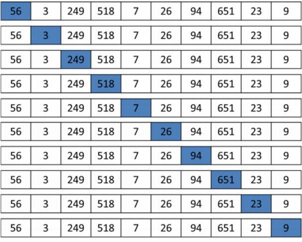
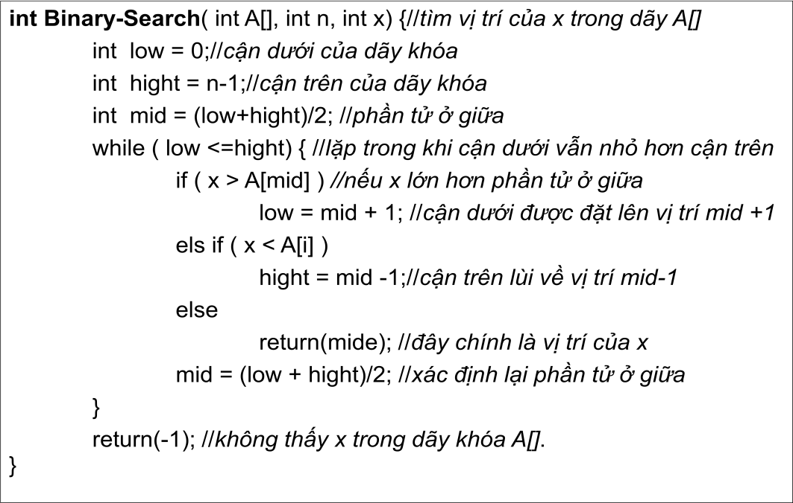
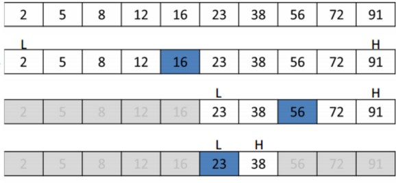
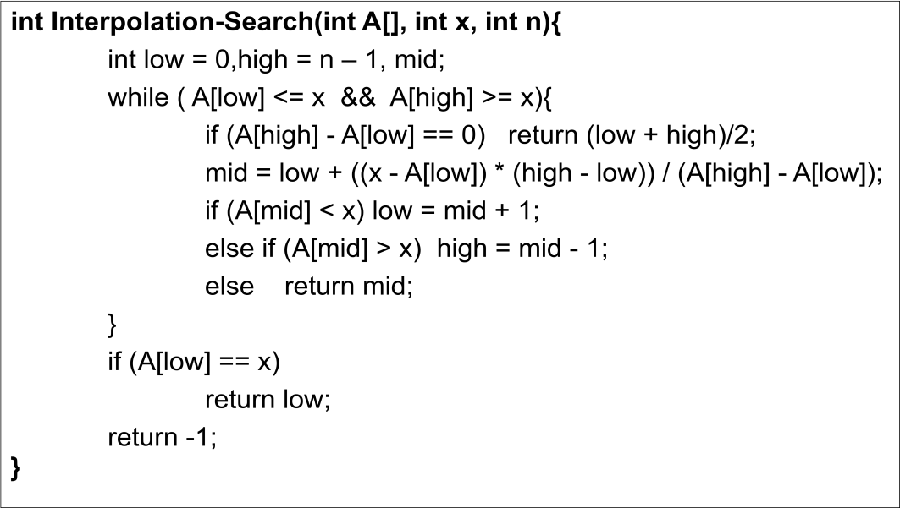
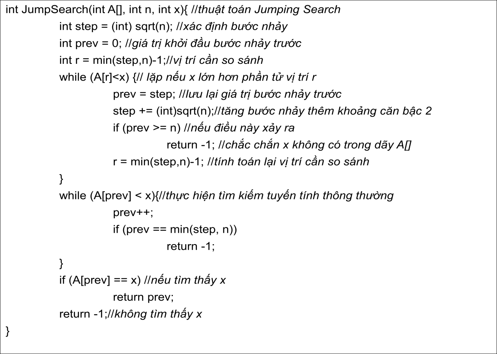

# Public_055

# Một số thuật toán tìm kiếm thông dụng

Tìm kiếm là lĩnh vực quan trọng của khoa học máy tính có mặt trong hầu hết các ứng dụng trên máy tính. Các thuật toán tìm kiếm được chia thành ba loại: tìm kiếm trên các đối tượng dữ liệu chưa được sắp xếp (tìm kiếm tuyến tính), tìm kiếm trên các đối tượng dữ liệu đã được sắp xếp (tìm kiếm nhị phân) và tìm kiếm xấp xỉ. Nội dung cụ thể của các phương pháp được thể hiện như dưới đây.

## Thuật toán tìm kiếm tuyến tính (Sequential Search)

Thuật toán tìm kiếm tuyến tính áp dụng cho tất cả các đối tượng dữ liệu chưa được sắp xếp. Để tìm vị trí của _x_ trong dãy A[] gồm _n_ phần tử, ta chỉ cần duyệt tuần tự trên dãy A[] từ phần tử đầu tiên đến phần tử cuối cùng. Nếu _x_ = A[ _i_ ] thì _i_ chính là vị trí của _x_ thuộc dãy A[]. Nếu duyệt đến phần tử cuối cùng vẫn chưa tìm thấy _x_ ta kết luận _x_ không có mặt trong dãy số A[]. Thuật toán được mô tả chi tiết trong Hình 3.9.

### Biểu diễn thuật toán

**Hình 3.9**. Thuật toán Sequential-Search.

### Độ phức tạp thuật toán

Độ phức tạp thuật toán là O(n), với n là số lượng phần tử trong dãy A[].

### Kiểm nghiệm thuật toán

Ví dụ ta cần tìm x = 9 trong dãy A[] = {56, 3, 249, 518, 7, 26, 94, 651, 23, 9 }. Khi đó quá trình tìm kiếm được thể hiện như dưới đây.

### Cài đặt thuật toán 

#include <iostream>
using namespace std;
int Sequential_Search( int A[], int n, int x){
for(int i=0; i<n; i++){
if ( x == A[i]) return i;
}
return -1;
}
int main(void){
int A[] = {9, 7, 12, 8, 6, 5};
int x = 15, n = sizeof(A)/sizeof(A[0]); int t = Sequential_Search(A,n,x); if(t>=0)cout<<"\n Vị trí của x:"<<t; else cout<<"\n Không tìm thấy x";
}

## Thuật toán tìm kiếm nhị phân

Thuật toán tìm kiếm nhị phân là phương pháp định vị phần tử _x_ trong một danh sách A[] gồm n phần tử đã được sắp xếp. Quá trình tìm kiếm bắt đầu bằng việc chia danh sách thành hai phần. Sau đó, so sách x với phần từ ở giữa. Khi đó có 3 trường hợp có thể xảy ra:

**Trường hợp 1** : nếu x bằng phần tử ở giữa A[mid], thì mid chính là vị trí của x trong danh sách A[].
**Trường hợp 2** : Nếu x lớn hơn phần tử ở giữa thì nếu x có mặt trọng dãy A[] thì ta chỉ cần tìm các phần tử từ mid+1 đến vị trí thứ n.
**Trường hợp 3** : Nếu x nhỏ hơn A[mid] thì x chỉ có thể ở dãy con bên trái của dãy A[].

Lặp lại quá trình trên cho đến khi cận dưới vượt cận trên của dãy A[] mà vẫn chưa tìm thấy _x_ thì ta kết luận _x_ không có mặt trong dãy A[]. Thuật toán được mô tả chi tiết trong Hình 3.10.

### Biểu diễn thuật toán

**Hình 3.10**. Thuật toán Binary-Search

### Độ phức tạp thuật toán

Độ phức tạp thuật toán là O(log(n)), với n là số lượng phần tử của dãy A[].

### Kiểm nghiệm thuật toán

Ví dụ ta cần tìm x = 23 trong dãy A[] = {2, 5, 8, 12, 16, 23, 38, 56, 72, 91}. Khi đó quá trình được tiến hành như dưới đây.

### Cài đặt thuật toán 

#include <iostream>  
using namespace std;
int Binary_Search( int A[], int n, int x) {//tìm vị trí của x trong dãy A[]
int low = 0; _//cận dưới của dãy khóa_
int hight = n-1; _//cận trên của dãy khóa_
int mid = (low+hight)/2; _//vị trí phần tử ở giữa_
while ( low <=hight) { // _lặp trong khi cận dưới nhỏ hơn cận trên_
if ( x > A[mid] ) _//nếu x lớn hơn phần tử ở giữa_
low = mid + 1; _//cận dưới dịch lên vị trí mid +1_
else if ( x < A[mid] ) _//nếu x nhỏ hơn phần tử ở giữa_
hight = mid -1; _//cận trên dịch xuống vị trí mid -1_
else
return(mid); // _đây chính là vị trí của x_
mid = (low + hight)/2; // _xác định lại vị trí ở giữa_
}
return(-1); // _không tìm thấy x trong A[]_.
}
int main(void){
int A[] = {2, 5, 8, 12, 16, 23, 38, 56, 72, 91};
int x = 91, n = sizeof(A)/sizeof(A[0]); int t = Binary_Search(A,n,x); if(t>=0)cout<<"\n Vị trí của x:"<<t; else cout<<"\n không tìm thấy x";
}

## Thuật toán tìm kiếm nội suy

Thuật toán tìm kiếm kiểu nội suy (interpolation search) là cải tiến của thuật toán tìm kiếm nhị phân. Thuật toán tìm kiếm nhị phân luôn thực hiện so sánh khóa với phần tử ở giữa. Trong đó, thuật toán tìm kiếm nội suy định vị giá trị so sánh tùy thuộc vào giá trị của khóa cần tìm. Bằng cách này, giá trị của khóa cần tìm kiếm dù ở đầu dãy, cuối dãy hay vị trí bất kỳ thuật toán đều tìm được vị trí gần nhất để thực hiện so sánh. Thuật toán được mô tả chi tiết trong Hình 3.11.

### Biểu diễn thuật toán

**Hình 3.11**. Thuật toán Interpolation-Search

### Độ phức tạp thuật toán

Độ phức tạp trung bình của thuật toán tìm kiếm nội suy là O(log(n)), với n là số lượng phần tử của dãy A[]. Trong trường hợp xấu nhất, thuật toán có độ phức tạp là O(n).

### Kiểm nghiệm thuật toán

Bạn đọc tự tìm hiểu phương pháp kiểm nghiệm thuật toán tìm kiếm nội suy trong các tài liệu liên quan.

### Cài đặt thuật toán 

#include <iostream>  
using namespace std;
int interpolationSearch(int A[], int n, int x){// _thuật toán tìm kiếm nội suy_
int L = 0, H = (n - 1);// _cận dưới và cận trên của dãy_
if (x < A[L] || x > A[H])// _nếu điều này xảy ra_
return -1; // _chắc chắn x không có mặt trong dãy A[]_
while (L <= H){// _lặp trong khi cận dưới bé hơn cận trên_
int pos = L + (((H-L) /(A[H]-A[L]))*(x - A[L])); // _xác định vị trí_
if (A[pos] == x)// _nếu vị trí đúng là x_
return pos; // _đây là vị trí cần tìm_
if (A[pos] < x)// _nếu x lớn hơn A[pos]_
L = pos + 1; // _dịch cận dưới lên 1_
else // _nếu x bé hơn A[pos]_
H = pos - 1; // _giảm cận trên đi 1_
}
return -1; // _kết luận không tìm thấy_
}
int main(){
int A[] = {10, 12, 13, 16, 31, 33, 35, 42, 47};
int n = sizeof(A)/sizeof(A[0]); int x = 42; // _phần tử cần tìm_
int index = interpolationSearch(A, n, x); if (index != -1)// _nếu tìm thấy x_
cout<<"Vị trí:"<<index;
else
cout<<"Không tìm thấy x";
}

## Thuật toán tìm kiếm Jumping

Thuật toán tìm kiếm Jumping được thực hiện bằng cách so sánh phần tử cần tìm với bước nhảy là một hàm mũ. Nếu khóa cần tìm lớn hơn phần tử tại bước nhảy ta nhảy tiếp một khoảng cũng là một hàm mũ. Trong trường hợp, khóa cần tìm nhỏ hơn phần tử tại bước nhảy, ta quay lại bước trước đó và thực hiện phép tìm kiếm tuyến tính thuần túy. Thuật toán được mô tả chi tiết trong Hình 3.12.

### Biểu diễn thuật toán

**Hình 3.12**. Thuật toán Jumping Search.

### Độ phức tạp thuật toán

Độ phức tạp thuật toán trong trường hợp tốt, xấu nhất là 𝑂(√𝑛). Trường hợp tốt nhất là O(log(n)), với n là số lượng phần tử của dãy A[].

### Kiểm nghiệm thuật toán

Giả sử ta cần tìm vị trí của x = 55 trong dãy số A[] = { 0, 1, 1, 2, 3, 5, 8, 13, 21,
34, 55, 89, 144, 233, 377, 610}. Khi đó, thuật toán được thực hiện như sau:
**Bước 1**. Ta tìm được step=4. So sánh 53 với vị trí số A[3]=2<55.
**Bước 2**. Dịch chuyển step = 8, so sánh 53 với vị trí số A[7]=13<55\. **Bước 3**. Dịch chuyển step = 16, so sánh 53 với vị trí số A[15]=610>55\. **Bước 4**. Vì 610>55 nên ta trở về bước trước đó cộng thêm 1 là 9.
**Bước 5**. Tìm kiếm tuyến tính từ vị trí 9 đến 15 ta nhận được kết quả là 10.

### **Cài đặt thuật toán**

#include <iostream> #include <cmath>
using namespace std;
int JumpSearch(int A[], int n, int x){ // _thuật toán Jumping Search_
int step = (int) sqrt(n); // _giá trị bước nhảy_
int prev = 0; // _giá trị bước nhảy trước_
int r = min(step,n)-1;//vị trí cần so sánh while (A[r]<x) {// _lặp trong khi A[r] <x_
prev = step; // _lưu lại giá trị bước trước_
step += (int)sqrt(n);// _tăng bước nhảy_
if (prev >= n) // _nếu điều này xảy ra_

return -1; // _x chắc chắn không có trong A[]_

r = min(step,n)-1; / _/tính toán lại vị trí cần so sánh_

}
while (A[prev] < x){// _tìm kiếm tuyến tính thông thường_
prev++;
if (prev == min(step, n)) return -1;
}
if (A[prev] == x) // _nếu tìm thấy x_
return prev;
return -1;// _không tìm thấy x_

}

int main(void){
int A[] = { 0, 1, 1, 2, 3, 5, 8, 13, 21,
34, 55, 89, 144, 233, 377, 610};
int x = 233, n = sizeof(A)/sizeof(A[0]); int index = JumpSearch(A, n,x);
if (index!=-1) cout<<"\n Vị trí:"<<index; else cout<<"\n Không tìm thấy x";
}