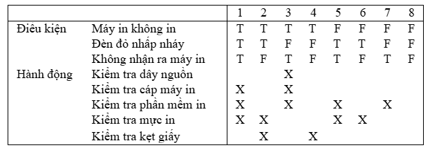
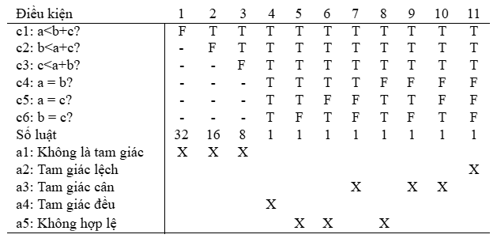

# Public_063

# Kiểm thử bằng bảng quyết định

Kỹ thuật kiểm thử lớp tương đương và kiểm thử giá trị biên thích hợp cho các hàm có các biến đầu vào không có quan hệ ràng buộc với nhau. Kỹ thuật kiểm thử dựa trên bảng quyết định sẽ phù hợp cho các hàm có các hành vi khác nhau dựa trên tính chất của bộ giá trị của đầu vào. Nói cách khác, kỹ thuật này phù hợp với các hàm/chương trình có các biến đầu vào phụ thuộc lẫn nhau.
Kiểm thử dựa trên bảng quyết định là phương pháp chính xác nhất trong các kỹ thuật kiểm thử chức năng. Bảng quyết định là phương pháp hiệu quả để mô tả các sự kiện, hành vi sẽ xảy ra khi một số điều kiện thỏa mãn.

## Bảng quyết định

Cấu trúc của một bảng quyết định chia thành bốn phần chính như trong Bảng 5.9, bao gồm:

  * Các biểu thức điều kiện _C_ 1 _, C_ 2 _, C_ 3;

  * Giá trị điều kiện T, F, –;

  * Các hành động _A_ 1 _, A_ 2 _, A_ 3 _, A_ 4; và

  * Giá trị hành động, có (xảy ra) hay không. Chúng ta ký hiệu X để chỉ hành động là có xảy ra ứng với các điều kiện tương ứng của cột.

Khi lập bảng quyết định, chúng ta thường tìm các điều kiện có thể xảy ra để xét các tổ hợp của chúng mà từ đó chúng ta sẽ xác định được các ca kiểm thử tương ứng cho các điều kiện được thỏa mãn. Các hành động xảy ra chính là kết quả mong đợi của ca kiểm thử đó.
Bảng quyết định với các giá trị điều kiện chỉ là T, F, và – được gọi là _bảng quyết định lôgic_. Chúng ta có thể mở rộng các giá trị này bằng các tập giá trị khác, ví dụ 1, 2, 3, 4, khi đó chúng ta có _bảng quyết định tổng quát_.
Bảng 5.10 là một ví dụ đơn giản về một bảng quyết định để khắc phục sự cố máy in. Khi máy in có sự cố, chúng ta sẽ xem xét tình trạng dựa trên các điều kiện trong bảng là đúng (T) hay sai (F), từ đó xác định được cột duy nhất có các điều kiện thỏa mãn, và thực hiện các hành động khắc phục sự cố tương ứng.

**Bảng 5.9: Ví dụ về một bảng quyết định**

Chú ý là ở đây thứ tự các điều kiện và thứ tự thực hiện hành động không quan trọng, nên chúng ta có thể đổi vị trí các hàng. Với các hành động cũng vậy, tuy nhiên tùy trường hợp chúng ta có thể làm mịn hơn bằng việc đánh số thứ tự hành động xảy ra thay cho dấu X để chỉ ra hành động nào cần làm trước. Với bảng quyết định tổng quát, các giá trị của điều kiện không chỉ nhận giá trị đúng (T) hoặc sai (F), khi đó ta cần tăng số cột để bao hết các tổ hợp có thể của các điều kiện.

**Bảng 5.10: Bảng quyết định để khắc phục sự cố máy in**

**Kỹ thuật thực hiện:** Để xác định các ca kiểm thử dựa trên bảng quyết định, ta dịch các điều kiện thành các đầu vào và các hành động thành các đầu ra. Đôi khi các điều kiện sẽ xác định các lớp tương đương của đầu vào và các hành động tương ứng với các mô-đun xử lý chức năng đang kiểm thử. Do đó mỗi cột tương ứng với một ca kiểm thử. Vì tất cả các cột bao phủ toàn bộ các tổ hợp đầu vào nên chúng ta có một bộ kiểm thử đầy đủ.
Trên thực tế không phải tổ hợp đầu vào nào cũng là hợp lệ, do đó khi sử dụng bảng quyết định người ta thường bổ sung thêm một giá trị đặc biệt “–” để đánh dấu các điều kiện không thể cùng xảy ra này. Các giá trị – (không quan tâm) có thể hiểu là luôn sai, không hợp lệ. Nếu các điều kiện chỉ là T và F ta có 2 _n_ cột qui tắc. Mỗi giá trị “–” sẽ đại diện cho hai cột. Để dễ kiểm tra không sót cột nào ta có thể thêm hàng đếm “Số luật” như trong Bảng 5.11 và khi tổng hàng này bằng 2 _n_ ta biết số cột qui tắc đã đủ.

**Bảng 5.11: Bảng quyết định cho hàm Triangle**

## Ví dụ minh họa

**Kiểm thử bằng bảng quyết định cho hàm Triangle:** Sử dụng bảng quyết định được mô tả ở Bảng 5.11, ta có 11 ca kiểm thử nhằm kiểm tra tính đúng đắn của hàm Triangle. Cụ thể, có ba (3) trường hợp không hợp lệ, ba (3) trường hợp không phải là tam giác, một (1) trường hợp tam giác đều, một (1) trường hợp tam giác thường và ba (3) trường hợp tam giác cân. Bảng 5.12 là kết
quả chi tiết về các ca kiểm thử này. Nếu ta thêm điều kiện kiểm tra bất đẳng thức tam giác ta sẽ có thêm ba (3) ca kiểm thử nữa (trường hợp một cạnh có độ dài bằng tổng hai cạnh còn lại).

**Bảng 5.12: Ca kiểm thử bằng bảng quyết định cho hàm Triangle**

| TT | a | b | c | Kết quả mong đợi |
| --- | --- | --- | --- | --- |
| 1 | 4 | 1 | 2 | Không phải tam giác |
| 2 | 1 | 4 | 2 | Không phải tam giác |
| 3 | 1 | 2 | 4 | Không phải tam giác |
| 4 | 5 | 5 | 5 | Tam giác đều |
| 5 | ? | ? | ? | Không khả thi |
| 6 | ? | ? | ? | Không khả thi |
| 7 | 2 | 2 | 3 | Tam giác cân |
| 8 | ? | ? | ? | Không khả thi |
| 9 | 2 | 3 | 2 | Tam giác cân |
| 10 | 3 | 2 | 2 | Tam giác cân |
| 11 | 3 | 4 | 5 | Tam giác thường |

 

**Kiểm thử bằng bảng quyết định cho hàm NextDate:** Có nhiều cách xác định các điều kiện. Ví dụ chúng ta sẽ đặc tả ngày và tháng trong năm và quy đổi về dạng của một năm nhuận hay một năm thông thường giống như trong lần thử đầu tiên, do đó năm 1900 sẽ không có gì đặc biệt. Các miền tương đương bây giờ như sau:

  * M1 = { tháng _|_ tháng có 30 ngày }

  * M2 = { tháng _|_ tháng có 31 ngày, trừ tháng 12 }

  * M3 = { tháng _|_ tháng 12 }

  * M4 = { tháng _|_ tháng 2 } 

Ngày

  * D1 = {ngày _|_ 1 _≤_ ngày _≤_ 27 }

  * D2 = {ngày _|_ ngày = 28 }

  * D3 = {ngày _|_ ngày = 29 }

  * D4 = {ngày _|_ ngày = 30 }

  * D5 = {ngày _|_ ngày = 31 } 

Năm

  * Y1 = {năm _|_ năm nhuận }

  * Y2 = {năm _|_ năm thông thường }

Trong khi tích Đề-các sẽ tạo ra 40 bộ giá trị nếu áp dụng kiểm thử lớp tương đương mạnh, bảng quyết định được lập như Bảng 5.13 chỉ cần 22 bộ giá trị ứng với 22 ca kiểm thử. Có 22 quy tắc, so với 36 trong thử lần hai. Chúng ta có một bảng quyết định với 22 quy tắc. Năm quy tắc đầu tiên cho tháng có 30 ngày. Hai bộ tiếp theo (6-10 và 11-15) cho tháng có 31 ngày, với các tháng khác Tháng Mười Hai và với Tháng Mười Hai.