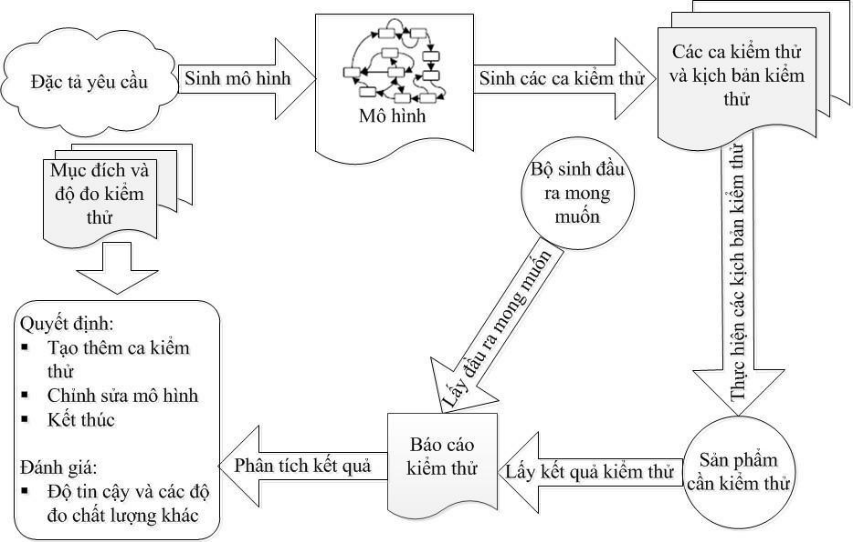
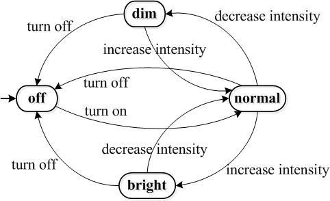
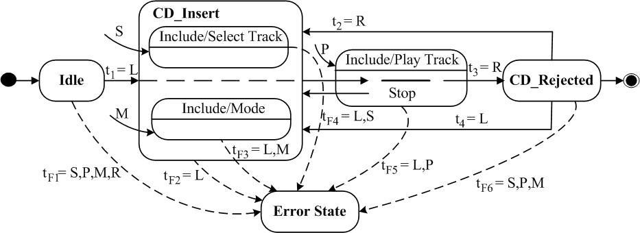
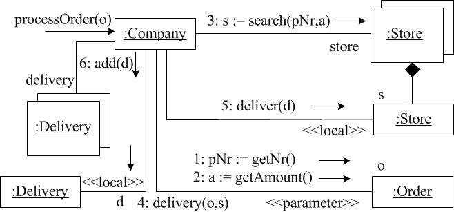

# Public_066

Chương này giới thiệu phương pháp và một số công cụ hỗ trợ kiểm thử dựa trên mô hình nhằm tăng tính hiệu quả và độ chính xác của các hoạt động kiểm thử. Kiểm thử dựa trên mô hình có thể sử dụng với nhiều mục đích khác nhau trong việc tự động hóa các hoạt động kiểm thử. Chúng tôi giới thiệu phương pháp này nhằm kiểm tra tính đúng đắn của việc lập trình so với thiết kế. Các phương pháp và công cụ hỗ trợ kiểm thử dựa trên mô hình có vai trò hết sức quan trọng trong việc nâng cao chất lượng của các sản phẩm và tăng tính cạnh tranh cho các công ty phần mềm.

# Khái niệm về kiểm thử dựa trên mô hình

Có nhiều khái niệm khác nhau về kiểm thử dựa trên mô hình. Tựu trung lại, chúng ta có thể hiểu kiểm thử dựa trên mô hình là một phương pháp kiểm thử nơi mà các ca kiểm thử được sinh ra từ mô hình đặc tả hành vi của hệ thống đang được kiểm thử. Mô hình này được biểu diễn bằng máy hữu hạn trạng thái, ôtômat, đặc tả đại số, biểu đồ trạng thái bằng UML, v.v.

Quá trình kiểm thử dựa trên mô hình được bắt đầu bằng việc xác định yêu cầu của hệ thống từ đó xây dựng mô hình dựa vào các yêu cầu và chức năng của hệ thống. Việc xây dựng mô hình còn phải dựa trên các yếu tố dữ liệu đầu vào và đầu ra. Mô hình này được sử dụng để sinh đầu vào cho các ca kiểm thử. Tiếp đến, chúng ta sẽ sinh giá trị đầu ra mong muốn ứng với mỗi bộ đầu vào. Khi kết thúc bước này, chúng ta đã có các ca kiểm thử. Các kịch bản kiểm thử sẽ được thiết kế và thực thi nhằm phát hiện các lỗi/khiếm khuyết của sản phẩm bằng cách so sánh đầu ra thực tế với đầu ra mong đợi tương ứng của ca kiểm thử. Từ các kết quả kiểm thử, chúng ta sẽ quyết định hành động tiếp theo như sửa đổi mô hình hoặc dừng kiểm thử.

Hình 8.1 mô tả các bước của quy trình kiểm thử dựa trên mô hình, bao gồm:

**Hình 8.1: Quy trình kiểm thử dựa trên mô hình [KJ02].** 

  * Sinh mô hình dựa trên các yêu cầu và chức năng của hệ thống.

  * Sinh các ca kiểm thử (bộ đầu vào và giá trị đầu ra mong đợi cho mỗi ca kiểm thử).

  * Chạy các kịch bản kiểm thử để phát hiện các lỗi/khiếm khuyết của sản phẩm.

  * So sánh kết quả đầu ra thực tế với kết quả đầu ra dự kiến.

  * Quyết định hành động tiếp theo (sửa đổi mô hình, tạo thêm ca kiểm thử, dừng kiểm thử, đánh giá chất lượng của phần mềm).

# Các phương pháp đặc tả mô hình

Để áp dụng phương pháp kiểm thử dựa trên mô hình, chúng ta cần xây dựng mô hình đặc tả chính xác hành vi của hệ thống cần kiểm thử. Mô hình này được đặc tả bằng một trong các phương pháp hình thức như: máy hữu hạn trạng thái, biểu đồ trạng thái, máy trạng thái UML, chuỗi Markov, văn phạm, bảng quyết định,

v.v. Trong mục này, chúng ta sẽ tìm hiểu một số phương pháp hình thức phổ biến được sử dụng để đặc tả mô hình của các hệ thống.

## Máy hữu hạn trạng thái

Máy hữu hạn trạng thái (Finite State Machine - FSM) được biết đến như là phương pháp đặc tả phổ biến nhất cho thiết kế và kiểm thử phần mềm nói riêng và các hệ thống nói chung. FSM rất hiệu quả trong việc đặc tả hành vi dựa trên việc chuyển trạng thái của các hệ thống. Một cách hình thức, FSM được định nghĩa như sau.

**Định nghĩa 8.1** (Máy hữu hạn trạng thái) **.** Máy hữu hạn trạng thái là một bộ bốn ( _S, Act, T, q_ 0), trong đó _S_ là tập hữu hạn các trạng thái, _T_ là tập các chuyển trạng thái, _Act_ là các tập các sự kiện (còn có tên khác là bảng ký hiệu) và _q_ 0 là trạng thái khởi tạo.

**Hình 8.2: Một ví dụ về máy hữu hạn trạng thái.**

**Bảng 8.1: Bảng chuyển của máy hữu hạn trạng thái trong hình 8.2**

|  | off | dim | normal | bright |
| --- | --- | --- | --- | --- |
| off |  |  | turn on |  |
| dim | turn off |  | incr. intensity |  |
| normal | turn off | decr. intensity |  | incr. intensity |
| bright | turn off |  | decr. intensity |  |

 

Hình 8.2 mô tả một ví dụ về một máy hữu hạn trạng thái đặc tả hành vi của một hệ thống chuyển công tắc đèn [KJ02]. Trong hình này, _off_ là trạng thái khởi đầu của hệ thống. Ở trạng thái này, đèn đang bị tắt. Với đầu vào là _turn on_ , hệ thống sẽ chuyển đến trạng thái _normal_ với đèn có độ sáng bình thường. Tại trạng thái này, chúng ta có thể tắt đèn (ứng với đầu vào _turn off_ và hệ thống sẽ chuyển về trạng thái _off_ ), tăng độ sáng của đèn (ứng với đầu vào _increase intensity_ và hệ thống sẽ chuyển về trạng thái _bright_ ) và giảm độ sáng của đèn (ứng với đầu vào _decrease intensity_ và hệ thống sẽ chuyển về trạng thái _dim_ ). Tại các trạng thái _dim_ và _bright_ , chúng ta có thể tắt đèn, tăng và giảm độ sáng tương ứng. Bảng 8.1 là một dạng đặc tả khác của máy hữu hạn trạng thái trên dưới dạng bảng chuyển. Chúng ta sẽ dùng cấu trúc dữ liệu này làm đầu vào cho các công cụ kiểm thử tự động.

## Ôtômat đơn định hữu hạn trạng thái

Tương tự như FSM, ôtômat đơn định hữu hạn trạng thái (Deter- ministic Finite state Automaton - DFA) cũng rất hiệu quả trong việc đặc tả hành vi dựa trên việc chuyển trạng thái của các hệ thống. Một cách hình thức, DFA được định nghĩa như sau.

**Định nghĩa 8.2** (Ôtômat đơn định hữu hạn trạng thái) **.** Ôtômat đơn định hữu hạn trạng thái là một bộ năm ( _S, Act, T, q_ 0 _, F_ ), trong đó: _S_ , _T_ , _Act_ và _q_ 0 được định nghĩa như trong định nghĩa của FSM, và _F_ ⊆ _S_ là tập các trạng thái kết thúc.

Một ví dụ minh họa về việc áp dụng DFA cho đặc tả hành vi của hệ thống trong kiểm thử dựa trên mô hình sẽ được giới thiệu trong mục 8.6.

## Biểu đồ trạng thái

Hình 8.3 mô tả ví dụ về một biểu đồ trạng thái đặc tả hành vi của một máy nghe nhạc. Trong biểu đồ này, trạng thái _CD_Insert_ gồm hai trạng thái con (Include/Select Track và Include/Mode). Hai trạng thái này hoạt động đồng thời. Khi chèn một CD vào máy nghe nhạc, chúng ta có thể chọn bài hát và xem thông tin của nó hoặc chúng ta có thể chọn bài hát và nghe. Cả hai chế độ này được thực hiện tại cùng một thời điểm. Một cách khác, chúng ta có thể nói _CD_Insert_ là một “trạng thái ghép nối” với tính đồng thời. Đây chính là sự khác biệt chính của biểu đồ trạng thái so với máy hữu hạn trạng thái. Bởi cách biểu diễn này, biểu đồ trạng thái có thể đặc tả hệ thống với ít trạng thái hơn và vì vậy nó giảm độ phức tạp cho quá trình đặc tả và kiểm thử/kiểm chứng sau này.

**Hình 8.3: Một ví dụ về biểu đồ trạng thái [BBH05].** 

## Máy trạng thái UML

Các phương pháp đặc tả hình thức như máy hữu hạn trạng thái, biểu đồ trạng thái, v.v. giúp ta đặc tả các hệ thống một cách chính xác với ý nghĩa duy nhất (vì chúng sử dụng các công cụ toán học). Tuy nhiên, các phương pháp này thường khó được áp dụng trong công nghiệp vì chúng đòi hỏi các chuyên gia về đặc tả hình thức.

Máy trạng thái UML được xem là giải pháp tốt để giải quyết vấn đề này. Nó có thể được sử dụng để đặc tả hành vi động (chuyển trạng thái) của các lớp đối tượng, các ca sử dụng (use cases), các hệ thống con và thậm chí là toàn bộ hệ thống. Tuy nhiên, máy trạng thái UML thường được sử dụng cho các lớp đối tượng. Theo [AJ00], biểu đồ cộng tác đặc tả bằng UML là một mô hình quan trọng trong việc kiểm thử hệ thống bởi mô hình này đặc tả chính xác hành vi (tương tác giữa các đối tượng) của hệ thống cần kiểm thử.

Trong UML, một trạng thái ứng với một điều kiện quan trọng của một đối tượng. Trạng thái này được quyết định bởi các giá trị hiện thời của đối tượng, các mối quan hệ với các đối tượng khác và các hành động (phương thức) mà đối tượng này thực hiện. Một phép chuyển trạng thái là mối quan hệ giữa hai trạng thái. Một phép chuyển trạng thái trong UML bao gồm một sự kiện được kích hoạt, điều kiện và hành động tương ứng. Các sự kiện được kích hoạt của các phép chuyển trạng thái có thể là một trong các sự kiện sau:

  * Một lời gọi ứng với một phương thức

  * Một tín hiệu nhận được từ các trạng thái khác trong máy trạng thái

  * Một sự thay đổi giá trị của một thuộc tính nào đó của một đối tượng

  * Hết thời gian (timeout)

Hình 8.4 là ví dụ về một máy trạng thái UML đặc tả hành vi của hệ thống quản lý bán hàng.

**Hình 8.4: Một ví dụ về máy trạng thái UML.** 

## Các phương pháp đặc tả khác

Ngoài những phương pháp đặc tả trên, có rất nhiều phương pháp đặc tả khác đã được đề xuất. Một số phương pháp đặc tả phổ biến như: mạng Petri (xem mục 3.6.3.2), chuỗi Markov, văn phạm, bảng quyết định/cây quyết định, ngôn ngữ ràng buộc đối tượng (OCL), các ngôn ngữ đặc tả đại số (Z, OBJ, v.v.), v.v. Phụ thuộc vào phương pháp và công cụ kiểm thử, chúng ta sẽ lựa chọn phương pháp đặc tả hệ thống tương ứng.