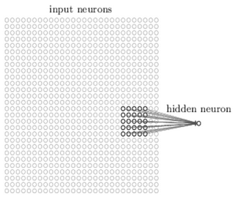
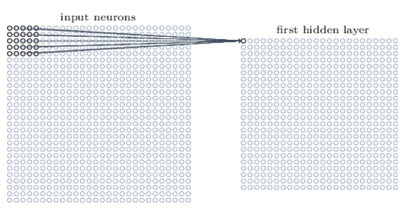
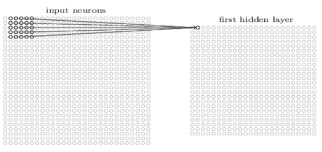
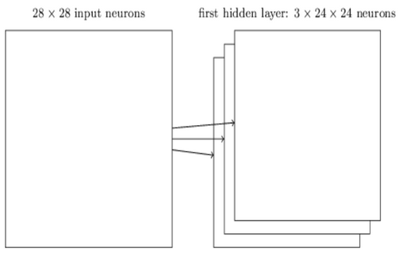
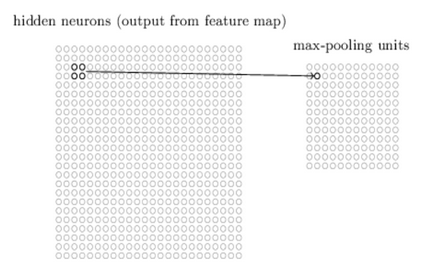
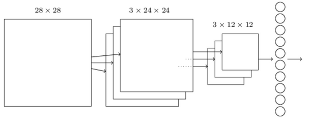

# Public079

# Giới thiệu

Phân tích ảnh y tế là một trong những ứng dụng quan trọng nhất của trí tuệ nhân tạo trong y học hiện đại. Các kỹ thuật truyền thống dựa trên đặc trưng thủ công (hand-crafted features) thường thiếu chính xác và khó tổng quát hóa cho các loại bệnh khác nhau. Mạng Thần Kinh Tích Chập (CNN) đã mở ra kỷ nguyên mới cho thị giác máy tính trong y tế, với khả năng học trực tiếp các đặc trưng từ dữ liệu hình ảnh lớn, từ đó hỗ trợ bác sĩ chẩn đoán nhanh và chính xác hơn.

CNN được áp dụng trong nhiều dạng dữ liệu y khoa: ảnh X-quang, MRI (Magnetic Resonance Imaging), CT (Computed Tomography), ảnh siêu âm, và ảnh hiển vi tế bào. Nhờ khả năng tự động trích xuất đặc trưng, CNN đã trở thành nền tảng của nhiều hệ thống hỗ trợ quyết định y khoa (Clinical Decision Support Systems).

# Nguyên lý hoạt động

CNN hoạt động dựa trên các lớp tích chập (convolutional layers) và lớp gộp (pooling layers) nhằm phát hiện các mẫu không gian trong hình ảnh.

  * Lớp tích chập (Convolutional Layer): Sử dụng bộ lọc (kernel) để phát hiện đặc trưng cục bộ như cạnh, đường viền, hình dạng.

  * Lớp gộp (Pooling Layer): Giảm chiều dữ liệu, giữ lại thông tin quan trọng, tăng tính bất biến với dịch chuyển.

  * Lớp kết nối đầy đủ (Fully Connected Layer): Kết hợp các đặc trưng đã học để phân loại bệnh lý.

  * Hàm kích hoạt phi tuyến (ReLU, Sigmoid, Softmax): Giúp mô hình học được các quan hệ phức tạp.

Điểm mạnh của CNN trong y tế là khả năng học đặc trưng phù hợp từ chính dữ liệu bệnh án, thay vì phụ thuộc vào chuyên gia thiết kế đặc trưng thủ công.

# Cấu trúc mạng CNN

Mạng CNN là một tập hợp các lớp Convolution chồng lên nhau và sử dụng các hàm nonlinear activation như ReLU và tanh để kích hoạt các trọng số trong các node. Mỗi một lớp sau khi thông qua các hàm kích hoạt sẽ tạo ra các thông tin trừu tượng hơn cho các lớp tiếp theo.

Mỗi một lớp sau khi thông qua các hàm kích hoạt sẽ tạo ra các thông tin trừu tượng hơn cho các lớp tiếp theo. Trong mô hình mạng truyền ngược (feedforward neural network) thì mỗi neural đầu vào (input node) cho mỗi neural đầu ra trong các lớp tiếp theo.

Mô hình này gọi là mạng kết nối đầy đủ (fully connected layer) hay mạng toàn vẹn (affine layer). Còn trong mô hình CNNs thì ngược lại. Các layer liên kết được với nhau thông qua cơ chế convolution.

Layer tiếp theo là kết quả convolution từ layer trước đó, nhờ vậy mà ta có được các kết nối cục bộ. Như vậy mỗi neuron ở lớp kế tiếp sinh ra từ kết quả của filter áp đặt lên một vùng ảnh cục bộ của neuron trước đó.

Mỗi một lớp được sử dụng các filter khác nhau thông thường có hàng trăm hàng nghìn filter như vậy và kết hợp kết quả của chúng lại. Ngoài ra có một số layer khác như pooling/subsampling layer dùng để chắt lọc lại các thông tin hữu ích hơn (loại bỏ các thông tin nhiễu).

Trong quá trình huấn luyện mạng (traning) CNN tự động học các giá trị qua các lớp filter dựa vào cách thức mà bạn thực hiện. Ví dụ trong tác vụ phân lớp ảnh, CNNs sẽ cố gắng tìm ra thông số tối ưu cho các filter tương ứng theo thứ tự raw pixel > edges > shapes > facial > high-level features. Layer cuối cùng được dùng để phân lớp ảnh.

Trong mô hình CNN có 2 khía cạnh cần quan tâm là **tính bất biến** (Location Invariance) và **tính kết hợp** (Compositionality). Với cùng một đối tượng, nếu đối tượng này được chiếu theo các gốc độ khác nhau (translation, rotation, scaling) thì độ chính xác của thuật toán sẽ bị ảnh hưởng đáng kể.

Pooling layer sẽ cho bạn tính bất biến đối với phép dịch chuyển (translation), phép quay (rotation) và phép co giãn (scaling). Tính kết hợp cục bộ cho ta các cấp độ biểu diễn thông tin từ mức độ thấp đến mức độ cao và trừu tượng hơn thông qua convolution từ các filter.

Đó là lý do tại sao CNNs cho ra mô hình với độ chính xác rất cao. Cũng giống như cách con người nhận biết các vật thể trong tự nhiên.

Mạng CNN sử dụng 3 ý tưởng cơ bản:

  * **các trường tiếp nhận cục bộ** (local receptive field)

  * **trọng số chia sẻ** (shared weights)

  * **tổng hợp** (pooling).

## Trường tiếp nhận cục bộ (local receptive field)

Đầu vào của mạng CNN là một ảnh. Ví dụ như ảnh có kích thước 28×28 thì tương ứng đầu vào là một ma trận có 28×28 và giá trị mỗi điểm ảnh là một ô trong ma trận. Trong mô hình mạng ANN truyền thống thì chúng ta sẽ kết nối các neuron đầu vào vào tầng ảnh.

Tuy nhiên trong CNN chúng ta không làm như vậy mà chúng ta chỉ kết nối trong một vùng nhỏ của các neuron đầu vào như một filter có kích thước 5×5 tương ứng (28- 5 + 1) 24 điểm ảnh đầu vào. Mỗi một kết nối sẽ học một trọng số và mỗi neuron ẩn sẽ học một bias. Mỗi một vùng 5×5 đấy gọi là một trường tiếp nhận cục bộ.

Một cách tổng quan, ta có thể tóm tắt các bước tạo ra 1 hidden layer bằng các cách sau:

  1. **Tạo ra neuron ẩn đầu tiên trong lớp ẩn 1** 

  2. **Dịch filter qua bên phải một cột sẽ tạo được neuron ẩn thứ 2.** 

với bài toán nhận dạng ảnh người ta thường gọi ma trận lớp đầu vào là feature map, trọng số xác định các đặc trương là shared weight và độ lệch xác định một feature map là shared bias. Như vậy đơn giản nhất là qua các bước trên chúng ta chỉ có 1 feature map. Tuy nhiên trong nhận dạng ảnh chúng ta cần nhiều hơn một feature map.

Như vậy, local receptive field thích hợp cho việc phân tách dữ liệu ảnh, giúp chọn ra những vùng ảnh có giá trị nhất cho việc đánh giá phân lớp.

## Trọng số chia sẻ (shared weight and bias)

Đầu tiên, các trọng số cho mỗi filter (kernel) phải giống nhau. Tất cả các nơ-ron trong lớp ẩn đầu sẽ phát hiện chính xác feature tương tự chỉ ở các vị trí khác nhau trong hình ảnh đầu vào. Chúng ta gọi việc map từ input layer sang hidden layer là một feature map. Vậy mối quan hệ giữa số lượng Feature map với số lượng tham số là gì?

_Chúng ta thấy mỗi fearture map cần 25 = 5×5 shared weight và 1 shared bias. Như vậy mỗi feature map cần 5×5+1 = 26 tham số. Như vậy nếu có 10 feature map thì có 10×26 = 260 tham số. Chúng ta xét lại nếu layer đầu tiên có kết nối đầy đủ nghĩa là chúng ta có 28×28=784 neuron đầu vào như vậy ta chỉ có 30 neuron ẩn. Như vậy ta cần 28x28x30 shared weight và 30 shared bias. Tổng số tham số là 28x28x30+30 tham số lớn hơn nhiều so với CNN. Ví dụ vừa rồi chỉ mô tả để thấy được sự ước lượng số lượng tham số chứ chúng ta không so sánh được trực tiếp vì 2 mô hình khác nhau. Nhưng điều chắc chắn là nếu mô hình có số lượng tham số ít hơn thì nó sẽ chạy nhanh hơn._

Xem tiếp...

Tóm lại, một convolutional layer bao gồm các feature map khác nhau. Mỗi một feature map giúp detect một vài feature trong bức ảnh. Lợi ích lớn nhất của trọng số chia sẻ là giảm tối đa số lượng tham số trong mạng CNN.

## Lớp tổng hợp (pooling layer)

Lớp pooling thường được sử dụng ngay sau lớp convulational để đơn giản hóa thông tin đầu ra để giảm bớt số lượng neuron.

Thủ tục pooling phổ biến là max-pooling, thủ tục này chọn giá trị lớn nhất trong vùng đầu vào 2×2.

Như vậy qua lớp Max Pooling thì số lượng neuron giảm đi phân nửa. Trong một mạng CNN có nhiều Feature Map nên mỗi Feature Map chúng ta sẽ cho mỗi Max Pooling khác nhau. Chúng ta có thể thấy rằng Max Pooling là cách hỏi xem trong các đặc trưng này thì đặc trưng nào là đặc trưng nhất. Ngoài Max Pooling còn có L2 Pooling.

Cuối cùng ta đặt tất cả các lớp lại với nhau thành một CNN với đầu ra gồm các neuron với số lượng tùy bài toán.

2 lớp cuối cùng của các kết nối trong mạng là một lớp đầy đủ kết nối (fully connected layer) . Lớp này nối mọi nơron từ lớp max pooled tới mọi nơron của tầng ra.

# Ứng dụng trong phân tích ảnh y tế

  * Chẩn đoán bệnh phổi từ ảnh X-quang: CNN có thể phát hiện viêm phổi, lao, hoặc COVID-19 với độ chính xác cao.

  * Phát hiện khối u từ MRI và CT: Hỗ trợ xác định kích thước, vị trí, và giai đoạn của khối u não, gan, hoặc phổi.

  * Phân đoạn polyp và tổn thương nội soi: CNN giúp phát hiện polyp ruột kết sớm, hỗ trợ phòng ngừa ung thư.

  * Nhận diện tế bào bất thường từ ảnh hiển vi: Ứng dụng trong xét nghiệm máu hoặc tế bào học (cytology).

  * Hỗ trợ phẫu thuật thông minh: Kết hợp CNN với hình ảnh thời gian thực từ camera nội soi để dẫn hướng phẫu thuật.

# Kiến trúc CNN phổ biến trong y tế

  * LeNet và AlexNet: Các mô hình khởi đầu, thường dùng cho dữ liệu ít phức tạp.

  * VGGNet, ResNet, DenseNet: Khả năng học sâu, xử lý dữ liệu ảnh y tế có độ phân giải cao.

  * U-Net: Chuyên biệt cho bài toán phân đoạn ảnh y tế, nổi bật trong phân đoạn MRI, CT và ảnh nội soi.

  * EfficientNet: Cân bằng hiệu quả giữa độ chính xác và tốc độ tính toán, phù hợp cho hệ thống y tế thời gian thực.

Ngoài ra, các mô hình mới như Vision Transformer (ViT) đang dần kết hợp với CNN để nâng cao khả năng xử lý hình ảnh y tế phức tạp.

# Lợi ích trong y tế

  * Chẩn đoán nhanh hơn: CNN phân tích hàng nghìn hình ảnh chỉ trong vài phút, hỗ trợ bác sĩ tiết kiệm thời gian.

  * Độ chính xác cao: Phát hiện những chi tiết tinh vi mà mắt thường có thể bỏ sót.

  * Hỗ trợ quyết định lâm sàng: Giúp bác sĩ có thêm bằng chứng trong quá trình chẩn đoán.

  * Giảm chi phí: Tự động hóa quy trình đọc phim, giảm tải cho nhân lực y tế.

  * Cá nhân hóa điều trị: Kết hợp CNN với dữ liệu bệnh nhân để dự đoán đáp ứng thuốc hoặc kết quả điều trị.

# Thách thức và hạn chế

  * Thiếu dữ liệu gắn nhãn: Dữ liệu y tế lớn nhưng việc gắn nhãn yêu cầu bác sĩ, tốn kém thời gian.

  * Chênh lệch dữ liệu (Data Shift): Mô hình huấn luyện trên dữ liệu bệnh viện này có thể hoạt động kém trên bệnh viện khác.

  * Giải thích mô hình (Explainability): CNN thường bị coi là “hộp đen”, khó giải thích kết quả cho bác sĩ.

  * Vấn đề đạo đức và pháp lý: Liên quan đến bảo mật dữ liệu bệnh nhân và trách nhiệm pháp lý khi AI chẩn đoán sai.

  * Yêu cầu tính toán cao: Đào tạo CNN cần GPU/TPU mạnh, khó triển khai tại bệnh viện nhỏ.

# Xu hướng tương lai

  * CNN kết hợp với Explainable AI (XAI): Tạo bản đồ nhiệt (heatmap) hiển thị vùng ảnh mà mô hình tập trung, giúp bác sĩ hiểu và tin tưởng hơn.

  * Học chuyển giao (Transfer Learning): Sử dụng mô hình tiền huấn luyện từ tập dữ liệu lớn để áp dụng vào lĩnh vực y tế, giảm nhu cầu dữ liệu nhãn.

  * Liên kết với Federated Learning: Nhiều bệnh viện cùng huấn luyện mô hình CNN mà không cần chia sẻ dữ liệu bệnh nhân, đảm bảo quyền riêng tư.

  * Ứng dụng mô hình nhẹ (Lightweight CNN): Tối ưu để chạy trên thiết bị cầm tay, máy siêu âm di động hoặc edge device trong bệnh viện.

  * Kết hợp CNN và Transformer: Tận dụng khả năng trích xuất đặc trưng cục bộ (CNN) và quan hệ toàn cục (Transformer) để nâng cao độ chính xác.