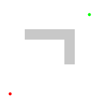
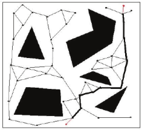
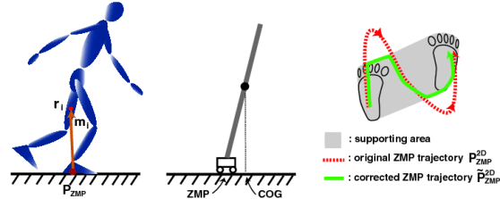
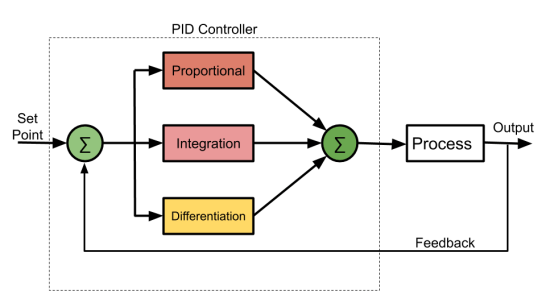

# Public085

# Giới thiệu

Nhà máy thông minh – nền tảng của Công nghiệp 4.0 – đòi hỏi mức độ tự động hóa và linh hoạt cao hơn bao giờ hết. Trong môi trường sản xuất hiện đại, dây chuyền phải thích ứng nhanh với thay đổi sản phẩm, khối lượng và yêu cầu chất lượng. Robot công nghiệp tự học chính là giải pháp: thay vì lập trình cứng, robot có khả năng học hỏi từ dữ liệu, tự tối ưu hành động và cộng tác an toàn với con người, tạo nên một thế hệ robot linh hoạt, thông minh và hiệu quả.

# Các loại thuật toán được sử dụng trong robot truyền thống

## Bất kỳ lúc nào A * Thuật toán

Thuật toán A * là một thuật toán tìm kiếm đường đi được sử dụng để tìm đường đi tối ưu nhất giữa hai điểm, tức là với chi phí nhỏ nhất.

Bất cứ lúc nào A * Algorithm có chi phí thời gian linh hoạt và có thể trả về đường đi ngắn nhất ngay cả khi nó bị gián đoạn vì nó tạo ra một giải pháp không tối ưu trước và sau đó tối ưu hóa nó.

Điều này cho phép ra quyết định nhanh hơn vì robot có thể xây dựng dựa trên các tính toán trước đó thay vì bắt đầu từ đầu.

### Cách sử dụng?

Nó thực hiện điều này bằng cách hình thành một 'cây' kéo dài từ nút bắt đầu cho đến khi các tiêu chí kết thúc được kích hoạt, có nghĩa là có sẵn một con đường ít tốn kém hơn.

Lưới 2D được tạo ra với các chướng ngại vật và ô bắt đầu và ô mục tiêu được thiết kế theo chiều nhọn.

Thuật toán xác định 'giá trị' của một nút bằng f là tổng các tham số g (chi phí di chuyển từ nút bắt đầu đến nút được đề cập) và h (chi phí di chuyển từ nút được đề cập đến nút đích).

### Ứng dụng

Rất nhiều trò chơi và bản đồ dựa trên web sử dụng thuật toán này để tìm đường đi ngắn nhất một cách hiệu quả. Nó cũng có thể được sử dụng cho rô bốt di động.

Bạn cũng có thể giải quyết các vấn đề phức tạp như [Newton – Raphson](https://www.sciencedirect.com/topics/mathematics/newton-raphson-method) phép lặp được áp dụng để tìm căn bậc hai của một số.

Nó cũng được sử dụng trong các bài toán về quỹ đạo để dự đoán chuyển động và va chạm của một vật thể trong không gian.

##  Thuật toán D *

D *, D * và D * Lite tiêu điểm là các thuật toán tìm kiếm tăng dần để tìm đường đi ngắn nhất giữa hai điểm.

Tuy nhiên, chúng là sự kết hợp của các thuật toán A * và những khám phá mới cho phép họ thêm thông tin vào bản đồ của mình cho những chướng ngại vật chưa biết.

Sau đó, họ có thể tính toán lại một tuyến đường dựa trên thông tin mới, giống như Mars Rover.

### Cách sử dụng?

Hoạt động của D * Algorithm tương tự như A *, đầu tiên thuật toán xác định f, h và tạo một danh sách mở và đóng.

Sau đó, Thuật toán D * xác định giá trị g của nút hiện tại bằng cách sử dụng giá trị g của các nút lân cận của nó.

Mỗi nút lân cận đưa ra phỏng đoán về giá trị g hiện tại của một nút và giá trị g ngắn nhất được điều chỉnh thành giá trị g mới.

### Ứng dụng

D * và các biến thể của nó được sử dụng rộng rãi cho rô bốt di động và [xe tự trị](https://hashdork.com/vi/thi%E1%BA%BFt-k%E1%BA%BF-h%E1%BB%87-th%E1%BB%91ng-xe-t%E1%BB%B1-h%C3%A0nh/) dẫn đường.

Các hệ thống định vị như vậy bao gồm một hệ thống nguyên mẫu được thử nghiệm trên tàu Mars rovers Cơ hội và Tinh thần và hệ thống định vị đã giành được [Thách thức đô thị DARPA](https://www.darpa.mil/about-us/timeline/darpa-urban-challenge).

##  Thuật toán PRM

PRM, hay lộ trình xác suất, là một đồ thị mạng lưới các đường đi có thể có dựa trên các không gian trống và bị chiếm dụng trên một bản đồ nhất định.

Chúng được sử dụng trong các hệ thống lập kế hoạch phức tạp và cũng để tìm ra các con đường chi phí thấp xung quanh các chướng ngại vật.

PRM sử dụng một mẫu ngẫu nhiên các điểm trên bản đồ của họ nơi thiết bị rô bốt có thể di chuyển và sau đó tính toán đường đi ngắn nhất.

### Cách sử dụng?

PRM bao gồm giai đoạn xây dựng và truy vấn.

Trong giai đoạn đầu, một lộ trình được vẽ biểu đồ gần đúng với các chuyển động có thể có trong một môi trường. Một cấu hình ngẫu nhiên sau đó được tạo và kết nối với một số hàng xóm.

Cấu hình bắt đầu và mục tiêu được kết nối với biểu đồ trong giai đoạn truy vấn. Đường dẫn sau đó thu được bởi một [Con đường ngắn nhất của Dijkstra](https://www.geeksforgeeks.org/dijkstras-shortest-path-algorithm-greedy-algo-7/) truy vấn.

### Ứng dụng

PRM được sử dụng trong các nhà lập kế hoạch cục bộ, trong đó thuật toán tính toán một đường thẳng giữa hai điểm, cụ thể là điểm ban đầu và điểm mục tiêu.

Thuật toán cũng có thể được sử dụng để cải thiện các ứng dụng lập kế hoạch đường đi và phát hiện va chạm.

## Thuật toán Zero Moment Point (ZMP)

Zero Moment Point (kỹ thuật ZMP) là một thuật toán được sử dụng bởi robot để giữ cho tổng quán tính ngược với phản lực của sàn.

Thuật toán này sử dụng khái niệm tính toán ZMP và áp dụng nó để cân bằng robot hai chân. Sử dụng thuật toán này trên bề mặt sàn nhẵn dường như cho phép robot đi lại như thể không có giây phút nào.

Các công ty sản xuất như ASIMO (Honda) sử dụng kỹ thuật này.

### Cách sử dụng?

Chuyển động của rô bốt đi bộ được lập kế hoạch bằng cách sử dụng phương trình mômen động lượng. Nó đảm bảo rằng chuyển động khớp được tạo ra đảm bảo sự ổn định tư thế động học của robot.

Độ ổn định này được định lượng bằng khoảng cách của điểm không mô men (được tính toán bằng thuật toán) trong ranh giới của vùng ổn định được xác định trước.

### Ứng dụng

Điểm zero moment có thể được sử dụng làm thước đo để đánh giá độ ổn định chống lại sự cố lật của robot như iRobot PackBot khi điều hướng đường dốc và chướng ngại vật.

## Thuật toán điều khiển vi phân tích phân tỷ lệ (PID)

Điều khiển vi sai tích phân tỷ lệ hoặc PID, tạo một vòng phản hồi cảm biến để điều chỉnh cài đặt cho các thành phần cơ khí bằng cách tính toán giá trị lỗi.

Các thuật toán này kết hợp cả ba hệ số cơ bản, tức là tỷ lệ, tích phân và đạo hàm để tạo ra tín hiệu điều khiển.

Nó hoạt động trong thời gian thực và áp dụng các chỉnh sửa khi cần thiết. Điều này có thể được nhìn thấy trong [xe tự lái](https://hashdork.com/vi/tesla-fsd-%E2%80%8B%E2%80%8Bbeta-v10/).

### Cách sử dụng?

Bộ điều khiển PID sử dụng ba thuật ngữ điều khiển là ảnh hưởng tỷ lệ, tích phân và đạo hàm trên đầu ra của nó để áp dụng điều khiển chính xác và tối ưu.

Bộ điều khiển này liên tục tính toán một giá trị lỗi là sự khác biệt giữa điểm đặt mong muốn và một biến quá trình đo được.

Sau đó, nó áp dụng một hiệu chỉnh để giảm thiểu lỗi theo thời gian bằng cách điều chỉnh biến điều khiển.

# Đặc trưng của robot tự học

  * Khả năng học tăng cường (Reinforcement Learning): Robot khám phá hành động mới, nhận phản hồi từ môi trường để cải thiện chiến lược điều khiển.

  * Học chuyển giao (Transfer Learning): Kỹ năng học được ở một nhiệm vụ (ví dụ lắp ráp linh kiện) có thể chuyển sang nhiệm vụ tương tự khác, rút ngắn thời gian đào tạo.

  * Thị giác máy tính tích hợp: Camera 3D và cảm biến độ sâu giúp robot nhận diện vật thể, vị trí và hướng, cho phép gắp nhặt vật liệu không định hình.

  * Cảm biến xúc giác và lực: Giúp điều chỉnh lực cầm nắm, giảm nguy cơ hư hỏng sản phẩm.

  * Điện toán biên (Edge AI): Xử lý dữ liệu và ra quyết định trực tiếp tại robot, giảm độ trễ so với gửi dữ liệu lên đám mây.

# Ứng dụng trong nhà máy thông minh

  * Lắp ráp linh kiện phức tạp: Robot học từ mẫu và tự điều chỉnh quỹ đạo khi vị trí linh kiện thay đổi.

  * Hàn và sơn tự động: Học cách tối ưu đường hàn/sơn cho các sản phẩm có hình dạng khác nhau.

  * Đóng gói và phân loại: Sử dụng thị giác để phân loại hàng hóa theo kích thước, màu sắc, tình trạng bề mặt.

  * Bảo trì và kiểm tra: Robot tự di chuyển, quét cảm biến, phát hiện hỏng hóc trong dây chuyền.

  * Cộng tác người – máy (Cobots): Làm việc an toàn cùng công nhân, học cách phối hợp và chia sẻ nhiệm vụ.

# Lợi ích nổi bật

  * Linh hoạt sản xuất: Dễ dàng thích nghi khi thay đổi mẫu mã, số lượng sản phẩm.

  * Tăng năng suất: Giảm thời gian ngừng máy và sai sót do con người.

  * Tiết kiệm chi phí dài hạn: Dù đầu tư ban đầu cao, nhưng giảm chi phí bảo trì, đào tạo và lập trình về sau.

  * Cải thiện an toàn: Robot xử lý các nhiệm vụ nguy hiểm, giảm tai nạn lao động.

# Công nghệ nền tảng

  * Mạng nơ-ron sâu (Deep Neural Networks): Giúp robot nhận diện vật thể và lập kế hoạch đường đi tối ưu.

  * Học tự giám sát (Self-Supervised Learning): Cho phép robot tận dụng dữ liệu chưa gắn nhãn để học cách cầm nắm và di chuyển.

  * Mô phỏng thực tế ảo (Simulation-to-Real Transfer): Huấn luyện robot trong môi trường ảo rồi chuyển kỹ năng sang thế giới thực, giảm chi phí thử nghiệm.

  * Kết nối IoT công nghiệp: Robot liên tục trao đổi dữ liệu với hệ thống quản lý sản xuất (MES) và kho dữ liệu lớn.

# Thách thức

  * Độ tin cậy và an toàn: Robot phải bảo đảm an toàn tuyệt đối khi làm việc chung với con người.

  * Chi phí đầu tư ban đầu: Phần cứng, cảm biến và hệ thống AI chất lượng cao đòi hỏi vốn lớn.

  * Quản lý dữ liệu khổng lồ: Cần hạ tầng lưu trữ và xử lý dữ liệu mạnh mẽ.

  * Chuẩn hóa và tích hợp: Phải tương thích với nhiều hệ thống điều khiển và phần mềm nhà máy khác nhau.

# Tác động kinh tế – xã hội

  * Tái cấu trúc lực lượng lao động: Giảm công việc lặp lại nguy hiểm, nhưng đòi hỏi đào tạo lại nhân sự cho các vị trí quản lý và giám sát robot.

  * Tăng sức cạnh tranh toàn cầu: Doanh nghiệp có thể sản xuất với tốc độ cao, chất lượng ổn định, giảm chi phí xuất khẩu.

  * Hỗ trợ sản xuất bền vững: Robot tối ưu năng lượng, giảm lãng phí nguyên liệu.

# Xu hướng tương lai

  * Robot tự học đa kỹ năng: Chuyển đổi giữa nhiều tác vụ mà không cần lập trình lại.

  * Kết hợp với trí tuệ nhân tạo tạo sinh: Robot có thể tự đề xuất cách sắp xếp dây chuyền mới hoặc thiết kế công cụ tùy biến.

  * Liên kết đám mây – biên: Mô hình huấn luyện lớn trên đám mây, suy luận nhanh tại robot.

  * Cộng tác liên robot: Nhiều robot giao tiếp và học lẫn nhau, tối ưu toàn bộ quy trình sản xuất