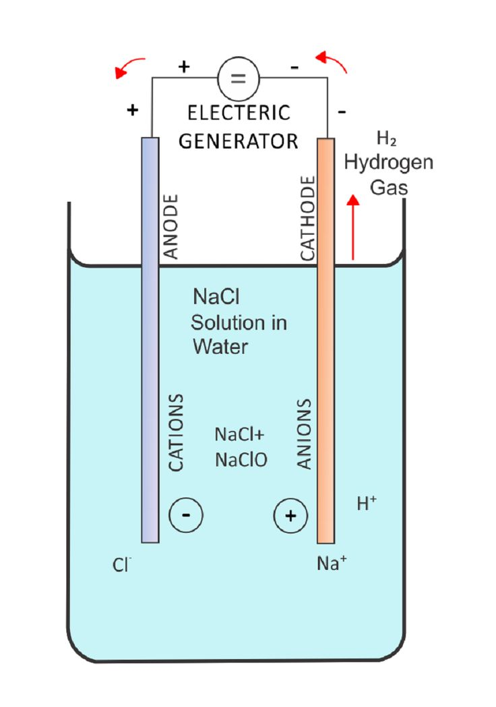
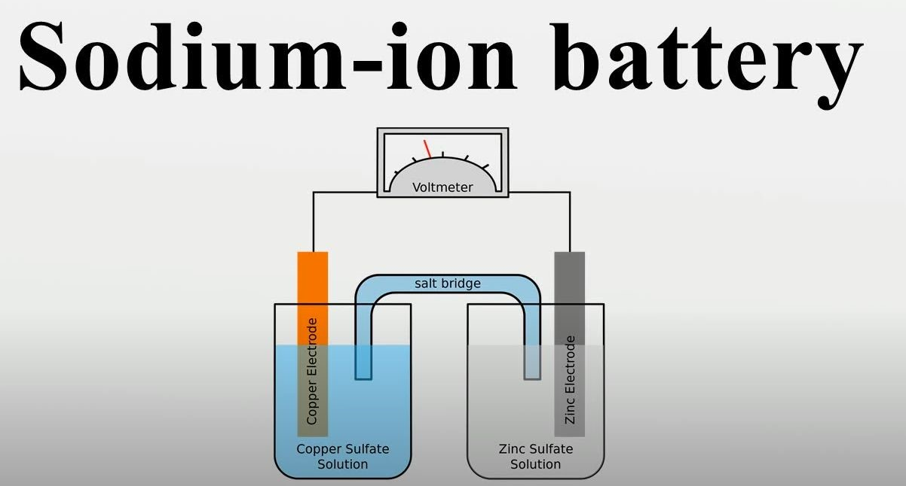

# Public099

# Giới thiệu

Sự bùng nổ của xe điện và lưu trữ năng lượng tái tạo khiến nhu cầu lithium tăng mạnh, kéo theo giá thành cao và rủi ro về nguồn cung. **Pin natri-ion (Sodium-Ion)** nổi lên như một giải pháp thay thế chiến lược nhờ **nguồn natri dồi dào** , giá rẻ và phân bố rộng rãi trên Trái Đất. Công nghệ này được xem là **lựa chọn quan trọng** để giảm phụ thuộc vào lithium và đáp ứng nhu cầu lưu trữ quy mô lớn cho lưới điện.

# Pin Natri-Ion (Sodium-Ion Battery) là gì?

Pin natri-ion là loại pin sử dụng **ion natri** (các hạt mang điện tích dương) thay vì **ion lithium** để lưu trữ và giải phóng năng lượng. Công nghệ này bắt đầu cho thấy tiềm năng thương mại từ những năm 1990 như một **giải pháp thay thế cho pin lithium-ion** , vốn đang phổ biến trong điện thoại và xe điện.

# Cơ chế hoạt động của pin natri-ion

Giống như mọi loại pin, pin natri-ion (Na-ion) gồm ba thành phần chính:

  * **Cực dương và cực âm (cathode & anode)**

  * **Chất điện phân** : cho phép các ion (hạt mang điện tích) di chuyển giữa hai cực.

Pin natri-ion hoạt động tương tự pin lithium-ion, chỉ khác là **ion natri thay cho ion lithium**. Vật liệu làm **điện cực và điện phân** có ảnh hưởng lớn đến **hiệu suất và tuổi thọ** , nên các nhà nghiên cứu liên tục thử nghiệm các tổ hợp mới để tìm ra giải pháp tối ưu về **chi phí – hiệu năng – độ an toàn**. Thông thường, **cực dương (cathode)** và **chất điện phân** chứa natri.

  * **Cấu trúc tương tự pin lithium-ion:** Bao gồm cực dương (cathode), cực âm (anode), chất điện phân và màng ngăn.

  * **Ion natri (Na⁺):** Di chuyển qua chất điện phân giữa hai cực trong quá trình sạc và xả.

  * **Khác biệt chính:** Bán kính ion natri lớn hơn lithium, đòi hỏi vật liệu điện cực và cấu trúc tối ưu để duy trì hiệu suất.

# Ưu điểm vượt trội

  * **Nguồn nguyên liệu dồi dào:** Natri chiếm ~2,3% lớp vỏ Trái Đất, khai thác rẻ hơn nhiều so với lithium.

  * **Chi phí thấp:** Giảm giá thành pin, đặc biệt quan trọng cho lưu trữ năng lượng lưới điện.

  * **Hiệu suất nhiệt độ thấp tốt:** Hoạt động ổn định ở môi trường lạnh hơn so với nhiều pin lithium-ion.

  * **Tính bền vững cao:** Giảm rủi ro địa chính trị liên quan đến khai thác lithium và cobalt.

# Ứng dụng

  * **Lưu trữ năng lượng tái tạo:** Dự trữ điện từ gió, mặt trời quy mô lớn với chi phí hợp lý.

  * **Xe điện đô thị:** Phù hợp cho xe tầm ngắn, xe máy điện, xe buýt thành phố.

  * **Thiết bị điện tử tiêu dùng:** Pin dự phòng, thiết bị IoT, nơi chi phí quan trọng hơn mật độ năng lượng.

  * **Lưới điện vi mô (Microgrid):** Giải pháp lưu trữ tại các vùng xa hoặc đảo, nơi cần chi phí thấp và tuổi thọ cao.

# Tiến bộ nghiên cứu

  * **CATL (Trung Quốc):** Giới thiệu pin natri-ion thương mại đầu tiên, mật độ năng lượng ~160 Wh/kg.

  * **Faradion (Anh):** Phát triển công nghệ an toàn, không cần hệ thống làm mát phức tạp.

  * **Hiện tượng kết hợp (Hybrid Systems):** Tích hợp natri-ion với lithium-ion để cân bằng chi phí và mật độ năng lượng.

# Thách thức

  * **Mật độ năng lượng thấp hơn lithium:** Hiện chỉ bằng 60–70% pin lithium-ion, hạn chế cho xe điện đường dài.

  * **Vật liệu điện cực:** Cần nghiên cứu anode/cathode mới để cải thiện dung lượng và tuổi thọ.

  * **Quy mô sản xuất:** Công nghệ mới, cần đầu tư lớn cho chuỗi cung ứng và nhà máy.

  * **Chuẩn hóa công nghiệp:** Chưa có tiêu chuẩn toàn cầu về kích thước và hiệu suất.

# Tác động kinh tế – xã hội

  * **Giảm phụ thuộc vào lithium và cobalt:** Giúp ổn định chuỗi cung ứng toàn cầu.

  * **Hạ giá thành lưu trữ năng lượng tái tạo:** Thúc đẩy điện gió, điện mặt trời, giảm phát thải carbon.

  * **Tạo việc làm mới:** Xây dựng nhà máy pin natri-ion và khai thác natri quy mô lớn.

# Tương lai

Trong 5–10 năm tới, khi công nghệ vật liệu cải thiện và quy mô sản xuất tăng, **pin natri-ion** có thể trở thành giải pháp chính cho lưu trữ năng lượng lưới điện và các phương tiện giao thông đô thị, bổ sung cho pin lithium-ion chứ không hoàn toàn thay thế.