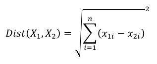
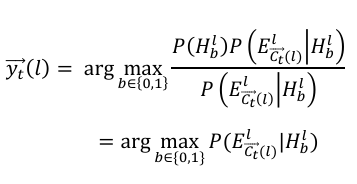
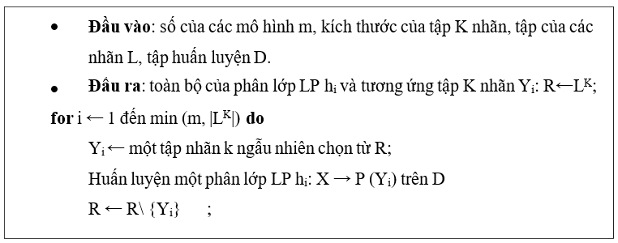

# Public_120

# Binary relevance (BR)

Phương pháp chuyển đổi đơn giản nhất là phương pháp chuyển đổi nhị phân (BR), tức là với mỗi nhãn khác nhau sẽ xây dựng một bộ phân lớp khác nhau. Phương pháp này xây dựng |L| bộ phân lớp nhị phân: Hl: X→ {l; -l} cho mỗi nhãn l khác nhau trong L. Thuật toán chuyển đổi dữ liệu ban đầu trong tập L nhãn. Nhãn là l nếu các nhãn của ví dụ ban đầu gồm l, nhãn là ⌐l trong trường hợp ngược lại. Theo [12], phương pháp này đã được sử dụng bởi Boutell (2004), Goncalves và Quaresma (2003), Lauser và Hotho (2003), Li và Ogihara (2003). Sau đây là ví dụ biểu diễn dữ liệu theo phương pháp này:

_Biểu diễn dữ liệu theo phương pháp nhị phân_

| Example | Label 0 | Label 1 (⌐ label 0) | … (⌐ label 0) | Label 99 (⌐ label 0) |
| --- | --- | --- | --- | --- |
| 1 | X |  |  |  |

 
| Example | Label 0(⌐label 1) | Label 1 | … (⌐label 1) | Label 99 (⌐ label 1) |
| --- | --- | --- | --- | --- |
| 2 |  | X |  |  |

 

#  Multi - label k-Nearest Neighbors (MLkNN)

Thuật toán kNN [14] (k-Nearest Neighbors) là phương pháp học máy được sử dụng rộng rãi, thuật toán tìm hàng xóm gần nhất của một đối tượng thử nghiệm trong không gian đặc trưng.

Bộ phân lớp dựa trên thuật toán K người láng giềng gần nhất là một bộ phân lớp dựa trên bộ nhớ, đơn giản vì nó được xây dựng bằng cách lưu trữ tất cả các đối tượng trong tập huấn luyện. Để phân lớp cho một điểm dữ liệu mới x’, trước hết bộ phân lớp sẽ tính khoảng cách từ điểm dữ liệu mới tới các điểm dữ liệu trong tập huấn luyện. Qua đó tìm được tập N (x’, D, k) gồm k điểm dữ liệu mẫu có khoảng cách đến x’ gần nhất. Ví dụ nếu các dữ liệu mẫu được biểu diễn bởi không gian vector thì chúng ta có thể sử dụng khoảng cách Euclidean để tính khoảng cách giữa các điểm dữ liệu với nhau. Sau khi xác định được tập N (x’, D, k), bộ phân lớp sẽ gán nhãn cho điểm dữ liệu x’ bằng lớp chiếm đại đa số trong tập N (x’, D, k).

Công thức tính Euclidean để tính khoảng cách giữa các điểm dữ liệu: Giả sử có hai phần tử dữ liệu X1=(x11, x12 … x1n) và X2=(x21, x22 ... x2n), độ đo khoảng cách Euclide được tính bằng công thức:

Mô tả thuật toán:

\- Đầu vào: tập dữ liệu học D đã có nhãn và đối tượng kiểm tra z.
\- Tiến trình:
\- Tính d (x, x’) khoảng cách giữa đối tượng kiểm tra và mọi đối tượng (x, y) ϵ D.
\- Lựa chọn tập Dz gồm k đối tượng ϵ
\- Đầu ra: nhãn của đối tượng kiểm tra được xác định là
𝑦′ = arg max ∑ 𝐼(𝑣 = 𝑦𝑖)
(𝑥𝑖,𝑦𝑖)
Trong đó:
\- v là một nhãn trong tập nhãn
\- I () là một hàm số trả lại giá trị 1 khi v có nhãn yi, 0 nếu trong trường hợp ngược lại.
\- X là đối tượng xét, y là nhãn của nó.

Nhược điểm của thuật toán k-NN: Đòi hỏi không gian lưu trữ lớn.

Thuật toán MLkNN [13] là thuật toán k-NN áp dụng cho bài toán gán đa nhãn.

Trong mỗi trường hợp kiểm tra t, ML-KNN có k hàng xóm N (t) trong mỗi tập huấn luyện. Kí hiệu Hl1 là trường hợp t có nhãn l, Hl0 là trường hợp t không có nhãn l, Elj (jÎ{0, 1 … K}) biểu thị cho các trường hợp đó, giữa K láng giềng của t, chính xác j thể hiện có l nhãn. Do đó, nền tảng trên vector _C_ t, phân loại vector _y_ t sử dụng theo nguyên tắc:

Sử dụng luận Bayesian, có thể viết lại:

Mã giả thuật toán MLkNN được trình bày như sau:

_Hình 2.1 Mã giả thuật toán ML-kNN_

#  Random k-labelsets (RAKEL)

Phương pháp Label Powerset (LP) là một phương pháp chuyển đổi của phân lớp dữ liệu đa nhãn mà có xem xét đến sự phụ thuộc của các nhãn lớp. Ý tưởng của phương pháp này là coi một tập con các nhãn như là một nhãn và tiến hành phân lớp như việc phân lớp dữ liệu đơn nhãn. Theo phương pháp này thì số lượng các tập con nhãn được tạo ra là rất lớn, Grigorios và đồng nghiệp [11] đã đề xuất phương pháp RAKEL với mục đích tính đến độ tương quan giữa các nhãn, đồng thời tránh những vấn đề nói trên của LP.
Định nghĩa tập K nhãn, cho tập nhãn L của phân lớp đa nhãn, L= {λi}, với i = 1…|L|. Một tập Y L với K = |L| gọi là tập K nhãn. Ta sử dụng giới hạn LK là tập của tất cả tập nhãn K khác nhau trên L. Kích thước LK cho bởi công thức: |LK| = (|L| K).
Thuật toán RAKEL là cấu trúc toàn bộ của m phân loại LP, với i = 1 …m, chọn ngẫu nhiên một tập K nhãn, Yi, từ Lk. Sau đó, học phân loại LP ℎ𝑖: 𝑋 → 𝑃(𝑌𝑖). Thủ tục của RAKEL:

_Hình 2.2 Mã giả thuật toán RAKEL_

Số của sự lặp lại (m) là một tham số cụ thể cùng dãy giá trị có thể chấp nhận được từ 1 tới |LK|. Kích cỡ của tập K nhãn là một tham số cụ thể cùng dãy giá trị từ 2 tới |L| - 1. Cho K = 1 và m = |L| ta phân loại toàn bộ nhị phân của phương pháp Binary Relevance, khi K = |L| (m = 1). Giả thiết việc sử dụng tập nhãn có kích thước nhỏ, số lặp vừa đủ, khi đó RAKEL sẽ quản lý để mô hình nhãn tương quan hiệu quả.

# ClassifierChain (CC)

Thuật toán này bao gồm chuyển đổi nhị phân L như BR. Thuật toán này khác với thuật toán BR trong không gian thuộc tính cho mỗi mô hình nhị phân, nó được mở rộng cùng nhãn 0/1 cho tất cả phân lớp trước đó [8]. Ví dụ, chuyển đổi giữa BR và CC cho (x, y) với y = [1, 0, 0, 1, 0] và x = [0, 1, 0, 1, 0, 0, 1, 1, 0] (giả sử, cho đơn giản, không gian nhị phân). Mỗi phân loại hj được huấn luyện dự đoán yj ϵ {0, 1}.
_Chuyển đổi nhị phân giữa BR và CC [8]  
_

| Chuyển đổi của BR | Chuyển đổi của CC |
| --- | --- |
| h: x→ y | h: x’→ y |
| h1: [0, 1, 0, 1, 0, 0, 1, 1, 0] 1h2: [0, 1, 0, 1, 0, 0, 1, 1, 0] 0h3: [0, 1, 0, 1, 0, 0, 1, 1, 0] 0h4: [0, 1, 0, 1, 0, 0, 1, 1, 0] 1h5: [0, 1, 0, 1, 0, 0, 1, 1, 0] 0 | h1: [0, 1, 0, 1, 0, 0, 1, 1, 0] 1h2: [0, 1, 0, 1, 0, 0, 1, 1, 0,1] 0h3: [0, 1, 0, 1, 0, 0, 1, 1, 0,1, 0] 0h4: [0, 1, 0, 1, 0, 0, 1, 1, 0,1, 0, 0] 1h5: [0, 1, 0, 1, 0, 0, 1, 1, 0,1, 0, 0, 1] 0 |