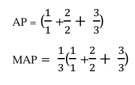

# Public_121

# Phương pháp đánh giá các mô hình phân lớp đa nhãn

Để đánh giá các mô hình phân lớp đa nhãn MLL, khóa luận đã sử dụng phương pháp k-fold cross validation tập dữ liệu ban đầu được chia ngẫu nhiên thành k tập con (fold) có kích thước xấp xỉ nhau S1, S2 … Sk. Quá trình học và kiểm tra được thực hiện tại k lần. Tại lần lặp thứ i, Si là tập dữ liệu kiểm tra, các tập còn lại hợp thành dữ liệu huấn luyện. Có nghĩa là, đầu tiên chạy được thực hiện trên tập S2, S3 … Sk, sau đó test trên tập S1; tiếp tục quá trình dạy được thực hiện trên tập S1, S3, S4 … Sk, sau đó test trên tập S2; và cứ tiếp tục như thế.

Ví dụ, k = 10, thì phương pháp k-fold cross validation được minh họa như hình dưới:

_Bảng minh họa phương pháp k-fold cross validation  
_

| K=1 |  |  |  |  |  |  |  |  |  |  |
| --- | --- | --- | --- | --- | --- | --- | --- | --- | --- | --- |
| K=2 |  |  |  |  |  |  |  |  |  |  |
| … |  |  |  |  |  |  |  |  |  |  |
| K=10 |  |  |  |  |  |  |  |  |  |  |

 

Trong đó: Là dữ liệu kiểm tra

Là dữ liệu học

##   

# Một số độ đo để đánh giá mô hình phân lớp đa nhãn

Đánh giá kết quả phương pháp phân lớp đa nhãn có sự khác biệt với đơn nhãn. Khóa luận đánh giá các phương pháp phân lớp đa nhãn dựa trên một số độ đo sau: Hamming Loss [15], One-error [15], Coverage [15], Ranking Loss [15], Average Precision, Mean Average Precision.

Cho một tập S = {(x1, Y1) … (xn, Yn)} của n ví dụ kiểm tra. Cho Y*i = h (xi) là tập hợp nhãn dự đoán cho kiểm tra xi, khi Yi là tập nhãn cho xi.

**Hamming Loss** : độ mất mát dữ liệu, được tính như sau:

Trong đó, 𝛿 là một hàm mà đầu ra là 1 nếu một nội dung đúng và 0 trong trường hợp ngược lại. Nhỏ hơn giá trị của hloss (h), thực thi tốt hơn. Trong trường hợp lí tưởng, hloss (h) = 0.

**One** - **error** : đánh giá lỗi cho nhãn xếp hạng đầu:

Giá trị nhỏ hơn one_err (f), thực thi tốt hơn. Chú ý, vấn đề phân loại cho đơn nhãn, một lỗi chính là phân loại lỗi thường.

**Coverage** : Để đánh giá hiệu suất của một hệ thống cho tất cả các nhãn của một mẫu (đếm số lượng tất cả các nhãn). Coverage được định nghĩa như khoảng cách trung bình cho tất cả các nhãn thích hợp được gán cho một ví dụ thử nghiệm:

**Ranking Loss** : Tính phân bố trung bình của các cặp nhãn:

Với 𝑌̅𝜄 là phần bù của tập nhãn Yi. Giá trị của rloss (f) càng nhỏ thì càng tốt.

**Average Precision** : độ chính xác trung bình của P@K tại các mức K có đối tượng đúng. Gọi I (K) là hàm xác định đối tượng ở vị trí hạng K nếu đúng I(K) = 1 và ngược lại I(K) = 0, khi đó:

Với n là số đối tượng được xét, P@K là độ chính xác của K đối tượng đầu bảng xếp hạng. Xác định số đối tượng đúng ở K vị trí đầu tiên của xếp hạng và gọi là Match@K và ta có

**Mean Average Precision** : Độ chính xác trung bình trên N xếp hạng. (N truy vấn, mỗi truy vấn có một thứ tự xếp hạng kết quả tương ứng).

Xét ví dụ:

Giả sử có có 5 đối tượng được xếp hạng tương ứng là: c, a, e, b, d

Một xếp hạng của đối tượng cần đánh giá là: **c, a, e** , d, b

Khi đó, P@1 = 1/1, P@2 = 2/2, P@3 = 3/3, P@4 = 3/4, P@5 = 3/5.

