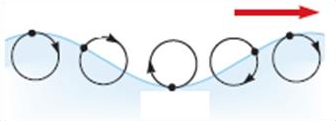
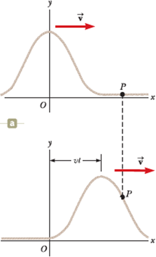
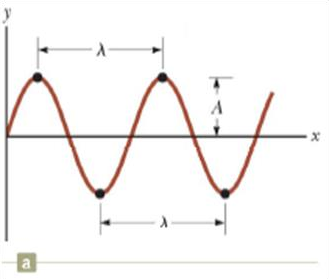
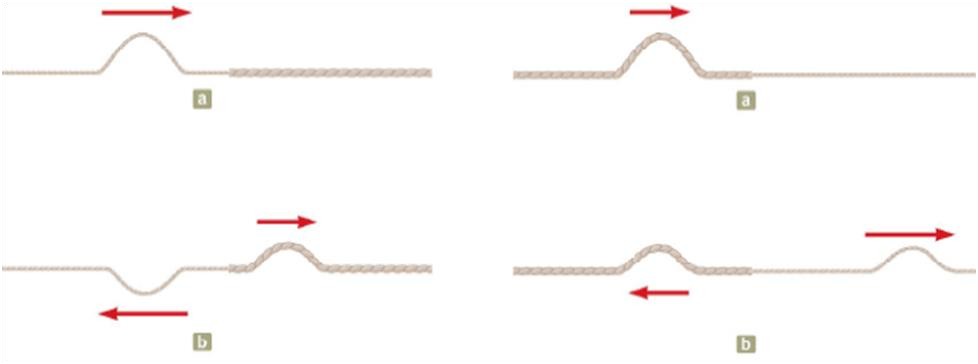

# Public_140

Thế giới chúng ta sống tràn ngập các loại sóng. Sóng nước là ví dụ thực tế cho ta hình dung khá rõ về sóng. Bằng cách ném một viên sỏi vào mặt nước phẳng lặng,tại điểm tiếp xúc của viên sỏi và mặt nước các sóng hình tròn được tạo ra và bắt đầu mở rộng dần từ điểm tiếp xúc (viên sỏi gọi là nguồn phát sóng). Nếu quan sát kỹ một vật nhỏ
nổi trên mặt nước ở gần nguồn sóng, ta sẽ thấy vật này di chuyển theo phương thẳng đứng và phương ngang quanh một vị trí gốc nhưng thực sự không di chuyển về phía nguồn phát sóng hoặc ra xa nguồn phát sóng. Chuyển động của vật nổi trên thực ra là do chuyển động của các phần tử nước tiếp xúc với vật truyền cho vật. Mọi phần tử nước khác trên mặt nước cũng chuyển động như vậy. Điều này có nghĩa là sóng nước thì cứ chuyển động ra xa nguồn nhưng nước thì không được vận chuyển theo. Trong hiện tượng sóng, dao động của các phần tử được lan truyền, nghĩa là năng lượng cũng đã được lan truyền từ nguồn sóng.
Chúng ta sẽ khảo sát hai loại sóng: sóng cơ học và sóng điện từ. Đối với sóng cơ học, để sóng hình thành và lan truyền được cần thiết phải có môi trường vật chất. Sóng điện từ có thể lan truyền trong môi trường vật chất và cả trong chân không.
Trong chương này, chúng ta sẽ tìm hiểu rõ hơn về sóng cơ học.

##  Sự lan truyền nhiễu loạn

  1. **Sự hình thành sóng**

Tất cả các sóng cơ học đều đòi hỏi phải có nguồn nhiễu loạn, môi trường vật chất để có thể truyền nhiễu loạn và một số cơ chế vật lý nhờ đó các phần tử môi trường tương tác lẫn nhau.
Để minh họa cho chuyển động sóng, chúng ta hãy xét thí nghiệm trình bày ở hình 16.1. Sau khikéo căng một sợi dây dài đã cố định một đầu, bằng cách giật nhanh tay lên và xuống đầu tự do của sợi dây ta sẽ thấy trên dây hình thành một cái bướu và nó dịch chuyển dọc trên dây. Bướu này gọi là _**xung**_. Trong thí nghiệm này, bàn tay là nguồn nhiễu loạn và sợi dây là môi trường để xung truyền đi. Các phần tử riêng biệt trên dây bị nhiễu loạn từ vị trí cân bằng của chúng và sự liên kết giữa các phần tử của dây làm cho nhiễu loạn được lan truyền dọc theo dây. Xung có chiều cao xác định và truyền dọc theo dây với tốc độ xác định. Hình dáng của xung thay đổi rất ít khi xung lan truyền dọc theo dây.
Bằng cách liên tục di chuyển lên và xuống đầu tự do của dây, chúng ta sẽ tạo ra được một sóng lan truyền trên dây. Sóng là một nhiễu loạn tuần hoàn di chuyển qua một môi trường.

  2. **Phân loại sóng**

_Hình 16.1: Mỗi lần bàn tay di chuyển một đầu dây lên và xuống sẽ tạo ra một xung truyền dọc theo dây_
Tùy thuộc vào phương dao động của các phần tử môi trường, sóng được chia thành hai loại: sóng ngang và sóng dọc.
_**Sóng ngang:**_ Khi lan truyền, sóng loại này sẽ làm cho các phần tử của môi trường chuyển động vuông góc với phương truyền sóng.Hình 16.2 mô tả một sóng ngang lan truyền trên sợi dây. Chuyển động của phần tử tại P được biểu diễn bằng mũi tên thẳng đứng. Hướng truyền của sóng được biểu diễn bằng mũi tên nằm ngang.
_**Sóng dọc:**_ Khi sóng này truyền qua, cho các phần tử của môi trường chuyển động song song với phương truyền sóng. Hình 16.3 là một ví dụ về sóng dọc khi tay liên tục di chuyển qua tới và lui. Một trường hợp khác cho sóng dọc là sóng âm.

_Hình 16.2_

_Hình 16.3: Một xung lan truyền dọc theo một lò xo_
Một số sóng thể hiện sự kết hợp đặc tính chuyển dời của cả sóng dọc và sóng ngang. Sóng trên mặt nước là một ví dụ. Khi sóng truyền trên mặt nước, các phần tử nước trên bề mặt di chuyển gần như thành vòng tròn. Nhiễu loạn có cả thành phần dọc và thành phần ngang.

  3. **Hàm sóng**

_Hình 16.4: Sóng nước_
Khảo sát một xung lan truyền về bên phải với vận tốc _v_ trên một sợi dây dài như trên hình
16.5. Hình 16.5a trình bày hình dạng và vị trí của xung tại thời điểm _t_ = 0 và xung này được mô tả bằng hàm số 𝑦(𝑥, 0) = 𝑓(𝑥). Hàm số này cho biết tọa độ y (độ dời) của phần tử có tọa độ _x_ trên dây vào thời điểm _t_ = 0. Sau khoảng thời gian _t_ , xung đi được quãng đường _vt_ (Hình 16.5b). Chúng ta giả sử rằng hình dạng của xung là không thay đổi theo thời gian. Trong trường hợp này,tọa độ _y_ của phần tử có tọa độ _x_ trên dây ở thời điểm _t_ bằngtọa độ _y_ của phần tử có tọa độ ( _x_ – _vt_ )trên dây ở thời điểm t = 0:
𝑦(𝑥, 𝑡) = 𝑦(𝑥 − 𝑣𝑡, 0)
Tóm lại: Khi xung di chuyển về bên phải (theo chiều dương trục Ox),tọa độ _y_ của phần tử có tọa độ _x_ trên dây ở thời điểm _t_ được xác định bởi hàm số:
𝑦(𝑥, 𝑡) = 𝑓(𝑥 − 𝑣𝑡) (16.1)
Tương tự: Khi xung di chuyển về bên trái, tọa độ _y_ của phần tử có tọa độ _x_ trên dây ở thời điểm _t_ được xác định bởi hàm số:
𝑦(𝑥, 𝑡) = 𝑓(𝑥 + 𝑣𝑡) (16.2) Hàm _y(x,t)_ được gọi là _**hàm sóng**_. Hàm số này cho biết tọa độ _y_ của phần tử bất kỳ tại vị trí _x_ vào thời điểm

_t_. Khi cố định _t_ , hàm sóng _y(x)_ cho biết hình dạng của

sóng ở thời điểm _t_ đó.

##  Sóng hình sin

Chúng ta sẽ xem xét một loại sóng có hình dạng như đồ thị của hàm sin, sóng loại này được gọi là sóng hình sin. Hình 16.6 mô tả một sóng hình sin đang di chuyển về phía bên phải với vận tốc _v_. Sóng này có thể được tạo ra trên một sợi dây như trong hình 16.1 khi đầu tự do của dây được rung để di chuyển lên xuống như một dao động điều hòa. Chúng ta chọn sóng hình sin để khảo sát vì mọi dạng sóng đều có thể xây dựng được bằng cách cộng các sóng hình sin có tần số và biên độ xác định. Sự hiểu biết về sóng hình sin là cơ sở để hiểu được các sóng có bất kỳ dạng nào.
Cần phân biệt hai loại chuyển động xảy ra khi một sóng lan truyền: chuyển động của sóng về phía bên phải theo trục Ox và dao động điều hòa của các phần tử môi trường theo trục Oy.
Chúng ta sẽ xem xét một loại sóng được đơn giản hóa như sau: sóng có một tần số duy nhất và có chiều dài vô hạn.

  1. **Các khái niệm và các đại lượng đặc trưng của sóng**

_Hình 16.6: Hình dạng sóng sin_

  * _**Đỉnh sóng**_ là điểm trong không gian mà phần tử môi trường tại đó có vị trí cao nhất. (Hình 16.7a).

  * _**Hõm sóng**_ là điểm trong không gian mà phần tử môi trường tại đó có vị trí thấp nhất.

  * _**Biên độ A của sóng**_ : là biên độ dao động của các phần tử môi trường. (Hình 16.7).

  * _**Tần số f của sóng**_ : là số đỉnh sóng (hoặc là bất kỳ điểm nào trên sóng) đi qua một điểm cho trước trong một đơn vị thời gian. Tần số sóng bằng với tần số dao động điều hòa của các phần tử môi trường.

  * Chu kỳ _**T của sóng**_ : là khoảng thời gian để hai đỉnh sóng liền nhau đi qua một một điểm cho trước trong không gian.Chu kỳ của sóng bằng với chu kỳ dao động điều hòa của các phần tử môi trường. (Hình 16.7b).

Chu kỳ và tần số của sóng liên hệ với nhau theo công thức:
1
T =
𝑓

(16.3)

  * _**Bước sóng λ**_ : là khoảng cách từ đỉnh (hõm) sóng này đến đỉnh (hõm) sóng kế tiếp. Tổng quát hơn, bước sóng là khoảng cách ngắn nhất giữa hai điểm đồng nhất trên sóng. (Phần tử môi trường tại hai điểm này dao động giống hệt nhau.)

  * _**Tốc độ truyền sóng v**_ : mỗi sóng sẽ lan truyền với tốc độ riêng, tốc độ này phụ thuộc vào tính chất của môi trường truyền sóng.

Tốc độ truyền sóng liên hệ với bước sóng và chu kỳ của sóng theo công thức:
𝜆
𝑣 =
𝑇
= 𝜆. 𝑓 (16.4)
 

  2. **Hàm sóng**

_Hình 16.7: (a) Hình ảnh của một sóng hình sin. (b) Vị trí của một phần tử môi trường như một hàm số của thời gian._

Giả sử xét một sóng hình sin ở thời điểm _t_ = 0 có hình dạng như ở hình 16.7a thì hàm sóng ở thời điểm này được cho bởi hàm số 𝑦(𝑥, 0) = 𝐴sin𝑎𝑥. Do tính chất tuần hoàn của hàm số này, ta suy ra được 𝑎 = 2𝜋/𝜆. Nên

𝑦(𝑥, 0) = 𝐴𝑠𝑖𝑛 (

2𝜋

𝜆
𝑥)
Nếu sóng truyền về bên phải (theo chiều dương trục x) thì theo 16.1, hàm sóng ở thời điểm _t_ là

𝑦(𝑥, 𝑡) = 𝐴𝑠𝑖𝑛 [

2𝜋

𝜆
(𝑥 − 𝑣𝑡)] (16.5)
Nếu sóng truyền về phía bên trái thì thay ( _x – vt_ ) thành ( _x + vt_ ) trong 16.5.
trong đó 𝜙là pha ban đầu.

  3. **Sóng hình sin trên dây**

Để tạo một một sóng trên dây, ta gắn một đầu dây vào một cần rung và cho cần rung dao động điều hòa (Hình 16.8). Mỗi phần tử trên dây dao động điều hòa theo phương thẳng đứng _y_ với tần số bằng tần số của cần rung, trong khi đó sóng truyền về bên phải theo chiều dương của trục Ox với tốc độ _v_.
Giả sử chọn _t_ = 0 là lúc hình dạng của dây như ở hình
16.8a thì hàm sóng được viết là:
𝑦 = 𝐴sin(𝑘𝑥 − 𝜔𝑡)
_sóng sin trên sợi dây._
𝑎𝑦,𝑚𝑎𝑥 = 𝜔2𝐴 (16.12)
Cần lưu ý rằng: tốc độ truyền sóng _v_ là hằng số đối với một môi trường đồng nhất, trong khi đó vận tốc của một phần tử trên dây _vy_ là một hàm sin của thời gian.

##  Tốc độ của sóng trên dây

Tốc độ của sóng phụ thuộc vào tính chất vật lý của dây và lực căng dây theo công thức:
𝑇
𝑣 = √
𝜇

(16.13)

với _μ_ là khối lượng trên một đơn vị chiều dài của dây (kg/m) và _T_ là lực căng dây.

##  Sự phản xạ và truyền qua của sóng

Ở nội dung này chúng ta sẽ xem xét một sóng bị ảnh hưởng như thế nào trong quá trình lan truyền khi gặp phải sự thay đổi trong môi trường.

_Hình 16.9: Sự phản xạ của một xung ở đầu cố định của sợi dây._
_Hình 16.10: Sự phản xạ của một xung ở đầu tự do của sợi dây._
Hình 16.9 mô tả một xung lan truyền trên một sợi dây căng ngang có một đầu buộc vào giá cố định. Khi xung di chuyển đến giá cố định, nghĩa là đến cuối dây, thì môi trường truyền bị thay đổi đột ngột. Kết quả là xung chuyển động dọc trên dây theo chiều ngược lại tạo thành xung phản xạ. Xung phản xạ này bị đảo ngược so với xung ban đầu (xung tới) nhưng không bị thay đổi hình dạng. Sự đảo ngược của xung phản xạ so với xung tới có thể được giải thích nhờ định luật Newton thứ ba.
Trong trường hợp trên đầu cuối của dây được buộc cố định. Ở một trường hợp khác, đầu cuối dây có thể di chuyển tự do theo phương thẳng đứng như hình 16.10. Xung phản xạ lúc này không bị đảo ngược và cũng có cùng hình dạng như xung tới.
Cuối cùng là một trường hợp trung gian của hai trường hợp trên. Khi xung di chuyển đến biên giữa hai môi trường, một phần năng lượng của xung tới sẽ bị phản xạ ngược lại, một phần năng lượng sẽ truyền qua môi trường kia.

_Hình 16.11: Một xung di chuyển trên một dây Hình 16.12: Một xung di chuyển trên một nhẹ đến chỗ nối với một dây nặng hơn. dây nặng đến chỗ nối với một dây nhẹ hơn._
Chẳng hạn như một sợi dây nhẹ được nối với một sợi dây nặng hơn như trên hình 16.11. Khi xung di chuyển trên dây nhẹ đến gặp điểm tiếp xúc của hai dây thì hai xung được hình thành đồng thời: xung phản xạ trở lại (bị đảo ngược và có biên độ nhỏ hơn xung tới) và xung truyền qua chuyển động trên dây nặng hơn (không bị đảo ngược). Trong trường hợp xung di chuyển trên dây nặng đến gặp điểm tiếp xúc với dây nhẹ hơn như ở hình 16.12 thì các xung phản xạ và xung truyền qua vẫn hình thành nhưng xung phản xạ không bị đảo ngược.

##  Tốc độ truyền năng lượng bởi sóng sin trên dây

Chúng ta hãy xem xét sự truyền sóng hình sin theo trục x trên một sợi dây căng ngang trên như hình 16.13.
Nguồn năng lượng là tác nhân bên ngoài gắn với đầu bên trái của dây. Tác nhân này thực hiện công ở
đầu bên trái của dây (bằng cách di chuyển lên xuống), nhờ đó năng lượng được truyền vào hệ và sau đó được
_Hình 16.13_
truyền dọc theo chiều dài của dây. Xét phần tử nhỏ có tọa độ _x_ , chiều dài _dx_ và khối lượng _dm_. Phần tử này (cũng như các phần tử khác trên dây) thực hiện dao động điều hòa theo phương thẳng đứng _y_ với phương trình
𝑦 = 𝐴sin(𝑘𝑥 − 𝜔𝑡)